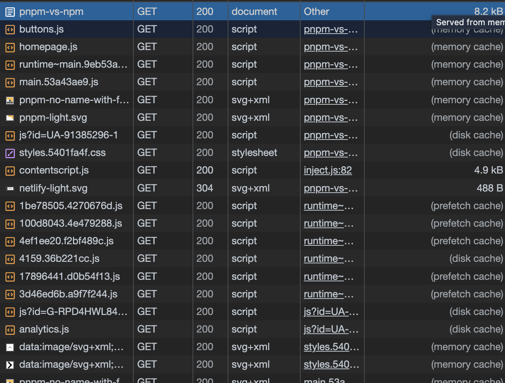

# 캐시 최적화

웹에서는 서비스에서 사용하는 image나 js 파일을 매번 네트워크를 통해 불러오지 않고, 최초에만 다운로드해서 브라우저 캐시에 저장한다.  
그 이후 요청시에는 브라우저에 저장해 둔 파일을 사용한다.

## 웹에서 사용하는 캐시의 종류

1. 메모리 캐시: 메모리(RAM)에 저장하는 방식
2. 디스크 캐시: 파일 형태로 디스크에 저장하는 방식

어떤 캐시를 사용할지는 직접 제어 불가능하며, 브라우저가 특정 알고리즘에 의해 알아서 처리한다.

### 실제 동작 확인

- Chrome의 Network 탭을 확인한다.
- disabe cache 설정을 끄고 페이지를 새로고침 시, **Size** 항목에 memory cache 또는 disk cache라고 표시되어 있는 것을 확인할 수 있다.

브라우저를 최초 렌더링 하고, 새로고침했을 때 이렇게 되어있다.CSS는 disk cache에 저장.. 신기..

응답 헤더에 Cache-Control이라는 헤더가 있어야 캐시 저장 가능!

max-age=0이라면 다시 불러오는걸 확인할 수 있다(netlify-light.svg) = no-cache와 동일한 설정!

## Cache control 옵션

- no-cache: 캐시를 사용하기 전 서버에 캐시된 리소스를 사용해도 되는지 한번 검사 후 사용
- no-store: 캐시 사용 안 함
- public: 모든 환경에서 캐시 사용 가능
- private: 브라우저 환경에서만 캐시 사용, 외부 캐시 서버에서는 사용 불가
- max-age: 캐시의 유효시간 (60: 60초)

public. max-age=0 : 0초는 사실상 캐시가 바로 만료되는 상태, 매번 서버에 캐시를 사용해도 되는지 확인한다; no-cache와 동일한 설정!

유효시간이 지난 후에도 파일이 변경되지 않았다면, 리로드시 서버에서는 변경되지 않았다는 304 status code를 응답으로 보냄!

304 Not Modified

> 캐시된 리소스와 서버의 최신 리소스가 같은지 다른지 어떻게 체크할까?
> → 캐시 유효 시간이 만료되면 브라우저는 캐시된 리소스를 계속 사용해도 될지 서버에 확인한다.
> 이떄 서버에서는 캐시된 리소스의 응답 헤더에 있는 Etag값과 서버에 있는 최신 리소스의 Etag값을 비교하여 판단!
> 서버 리소스가 변했다면 Etag값이 달라지므로, 서버는 새로운 Etag값과 함께 최신 리소스를 다시 브라우저로 보내준다.

일반적으로 HTML 파일에는 no-cach설정. 항상 최신버전의 웹 서비스를 제공하기 위함.

but CSS, JS는 빌드되면 파일명에 해시를 함께 가지고있다(main.j23r4qa.chunk.js)

→ 코드가 변경되면 해시도 변경되어 완전히 다른 파일이 된다. 따라서 캐시를 아무리 오래 적용해도 HTML만 최신상태라면 JS, CSS + Image는 당연히 최신 리소스를 로드할것.
