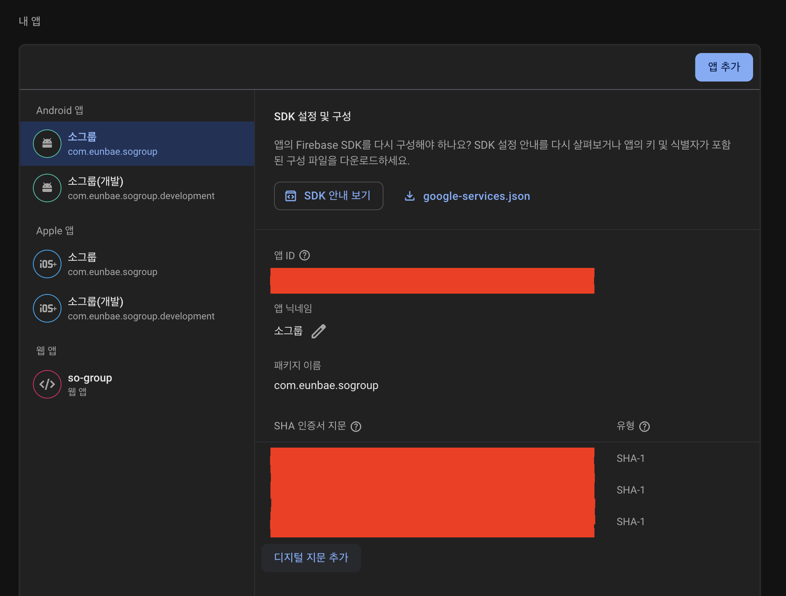

# com.google.android.gms .common.api.ApiException: 10 에러

## 문제

안드로이드 기기에서 해당 exception Error가 발생하며 구글 로그인이 안되는 문제

## 해결

### signingReport 확인

안드로이드 폴더에서 `signingReport` 확인
```bash
$ ./gradlew signingReport
```

SHA1값을 복사하여 구글 개발자 콘솔 설정에 등록한다.


