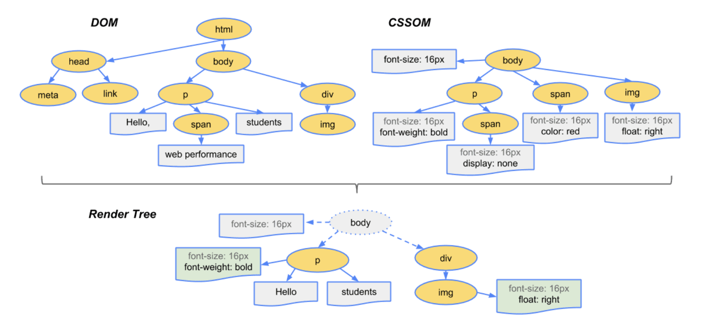

# 브라우저 렌더링 과정

## 구문 분석(Parsing)

구문 분석은 브라우저가 네트워크를 통해 받은 데이터(html)를 DOM이나 CSSOM으로 바꾸는 단계입니다.

### DOM 트리 구축

브라우저는 가장 먼저 HTML을 처리하여 DOM 트리를 만듭니다. HTML 구문 분석은 토큰화 (en-US)와 트리 생성을 포함합니다. HTML 토큰은 시작 및 종료 태그 그리고 속성 이름 및 값을 포함합니다. 만약 문서가 잘 구성되어 있다면 구문 분석은 명확하고 빠르게 이루어집니다. 구문 분석기는 토큰화된 입력을 분석하여 DOM 트리를 만듭니다.

DOM 트리는 문서의 내용을 설명합니다. html 요소는 시작하는 태그이고 DOM 트리의 루트 노드입니다. 트리는 다른 태그간의 관계와 계층을 반영합니다. 다른 태그에 감싸져 있는 태그는 자식 노드입니다. DOM 노드의 개수가 많아질수록, DOM 트리를 만드는데 더 오랜 시간이 걸립니다.

### CSSOM 트리 구축

다음으로 브라우저는 전송받은 CSS를 작업 가능한 상태로 변환하기 위해 CSSOM 트리를 만듭니다. 브라우저는 CSS에 있는 각각의 규칙을 읽고, 트리 노드를 만듭니다. CSS 선택기에 기반해서 부모 노드, 자식 노드, 형제 관계의 노드를 만들어집니다.

CSSOM 트리는 사용자 에이전트의 스타일 시트를 포함합니다. 브라우저는 노드에 적용 가능한 가장 일반적인 규칙부터 적용합니다. 그리고 재귀적으로 더 구체적으로 적용된 규칙에 따라 계산된 스타일을 수정해갑니다. 다른 말로, 속성 값을 캐스케이드합니다.

:::tip
CSSOM을 만드는 것은 매우 빠르기 때문에 CSSOM을 만드는데 드는 시간은 일반적으로 한 번의 DNS 조회를 하는 시간보다 짧습니다. 따라서 웹 성능 최적화의 관점에서 CSSOM 트리 구축 단계는 성능 향상에 큰 기여를 할 수 있는 영역은 아닙니다.
:::

## 렌더(Render)

### 스타일(Style)

다음으로 브라우저는 DOM과 CSSOM을 합쳐 렌더 트리를 만듭니다. 렌더 트리는 DOM 트리의 루트부터 시작하여 Node를 순회하며 만들어집니다.

:::tip
**display: none**과 같은 스타일 속성을 가진 요소와 같이 화면에 나타나지 않는 태그의 경우, 렌더링 결과에 나타나지 않기 때문에 렌더 트리에 포함되지 않습니다.  
반면 **visibility: hidden** 속성을 가진 요소는 자리를 차지하기 때문에 렌더 트리에 포함됩니다.
:::

:::tip
CSS는 px, %, em, rem등 다양한 단위로 작성할 수 있는데, rem등 상대적인 값은 픽셀로 치환되어 계산됩니다.
:::

각각의 보이는 노드는 그 노드에 적용된 CSSOM 규칙이 있으며, 렌더 트리가 보이는 모든 노드의 내용과 계산된 스타일을 가지고 있습니다. DOM 트리에서 보이는 모든 노드에 관련된 스타일을 모두 맞춰보고, CSS 캐스케이드 (en-US) 방식에 따라서 각 노드의 계산된 스타일이 무엇일지 결정합니다.

### 레이아웃(Layout)

레이아웃(Layout)은 앞서 생성된 렌더 트리에 있는 모든 노드의 너비, 높이, 위치를 결정하는 프로세스입니다. 추가로 화면에서 각 객체의 크기와 위치를 계산합니다.

렌더 트리가 한 번 만들어지고 나면 레이아웃이 시작됩니다. 렌더 트리는 계산된 스타일과 함께 어떤 노드가 화면에 표시될지 식별하지만, 각 노드의 위치나 좌표를 알지는 못합니다. 이에 각 객체의 정확한 크기와 위치를 결정하기 위해서 브라우저는 렌더 트리의 Root부터 시작하여 순회합니다.

### 레이어(Layer)

렌더 트리는 레이아웃(Layout) 이후 정해진 기준에 따라 layer를 나누게 됩니다.
브라우저는 레이어를 크게 2가지로 분류합니다.

- RenderLayer
- GraphicsLayer

layout 단계에서 Layout Object로 구성된 Layout Tree가 생성되고, Layout Object에서 아래 조건을 만족하면 별도의 Paint Layer가 생성됩니다.

- 3D나 perspective를 표현하는 CSS transform 속성을 가진 경우
- (플래시와 같은) 플러그인 영역
- 투명도(opacity) 속성 혹은 webkit transform의 애니메이션의 사용
- 가속 가능한 CSS 필터를 가진 경우(css filter)
- 합성 레이어(Compositing Layer)를 하위 노드로 가진 경우
- 낮은(lower) z-index를 가진 형제 노드(Sibling)가 합성 레이어(Compositing Layer)를 가진 경우

:::tip
layer를 분리하면 paint는 처음에만 일어나며, reflow(relayouting)와 repaint를 하지 않습니다. 레이어가 분리되어 다르게 동작하기 때문입니다.
:::

:::warning
레이어는 성능을 향상시킵니다. 하지만 메모리 관리 측면에서 봤을 때는 비싼 작업이기 때문에, 웹 성능 최적화 전략으로 과도하게 쓰이지는 않아야 합니다.
:::

### 페인트(Paint)

브라우저는 각 노드를 화면에 처음 페인팅하는 페인트(Paint)작업을 수행합니다. 이 단계에서 브라우저는 레이아웃 단계에서 계산된 각 박스를 실제 화면의 픽셀로 변환합니다.
페인트 단계에서 텍스트, 색깔, 경계, 그림자 및 버튼이나 이미지 같은 alt 요소를 포함하여 모든 요소의 시각적인 부분을 화면에 그리는 작업이 수행됩니다.

### 합성(Compositing)

painting 과정을 거친 Layer들을 합성하는 과정입니다.(composite layers)
이 단계에서 브라우저는 layer들을 합성하여 하나의 bitmap으로 만든 뒤 최종 page를 만듭니다.

## 리플로우와 리페인팅

### 리플로우(Reflow)

레이아웃 단계에서 처음 노드의 사이즈와 위치가 결정된 이후에 **노드의 크기와 위치를 다시 계산**하는 것을 리플로우(Reflow)라고 합니다.

예를 들어 이미지를 불러 오기 전 레이아웃이 일어난 경우, 이미지의 크기를 선언하지 않았기 때문에 이미지 크기를 알게 된 이후 리플로우가 한 번 일어나게 됩니다.

### 리페인팅(Repainting)

각 노드를 화면에 다시 페인팅하는 작업을 리페인팅(Repainting)이라 합니다.

## 참고문서

https://developer.mozilla.org/ko/docs/Web/Performance/How_browsers_work
