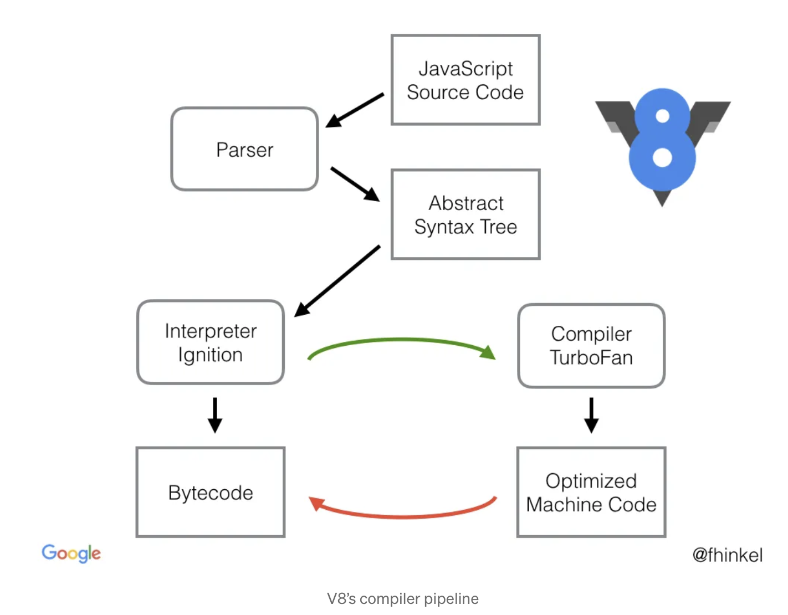
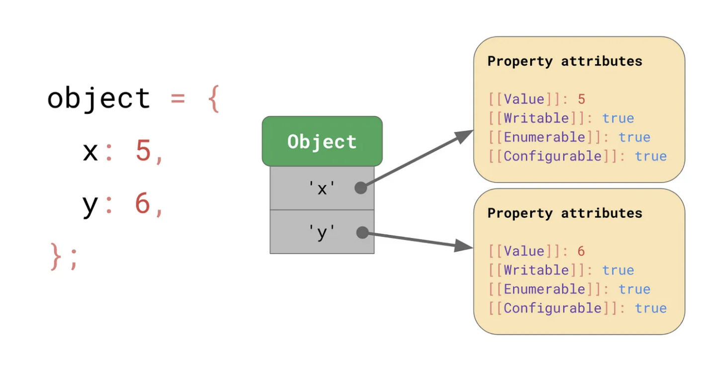
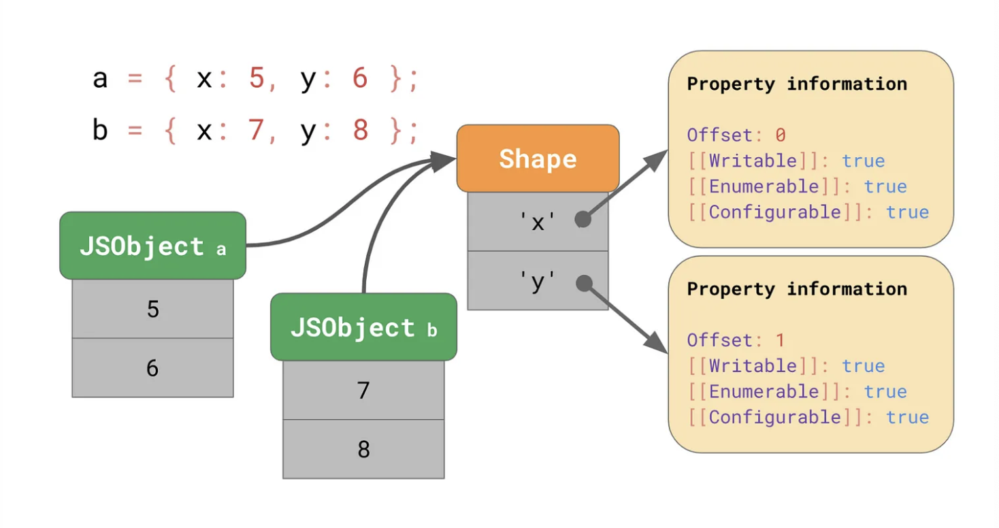
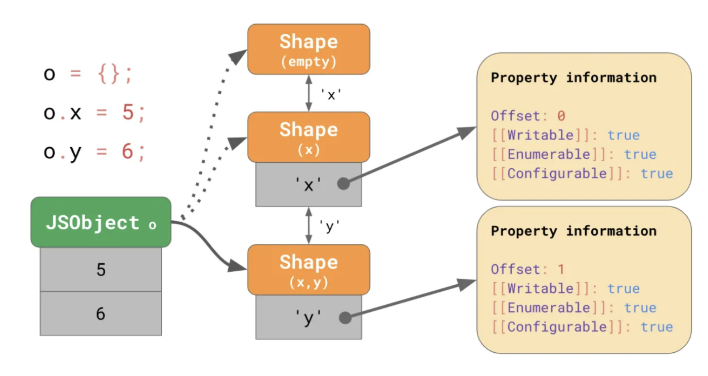
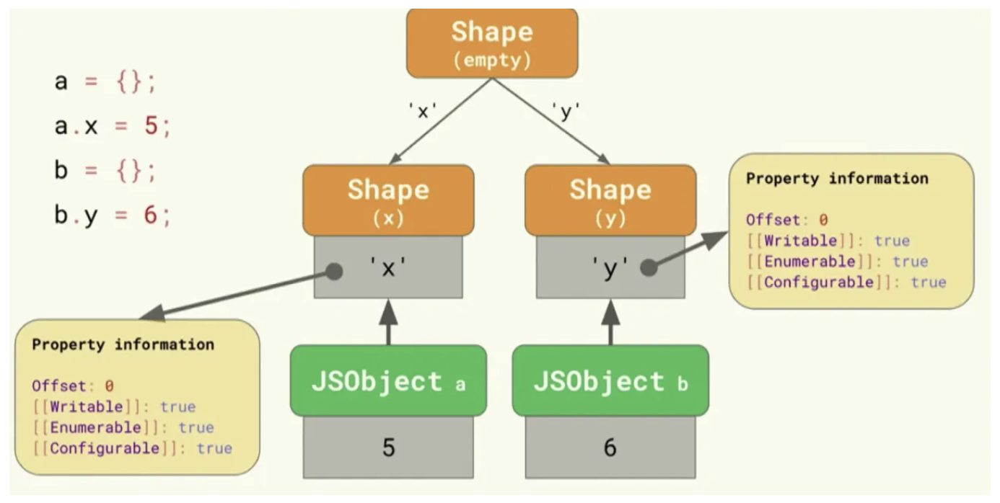
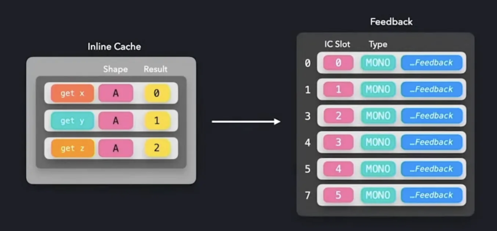
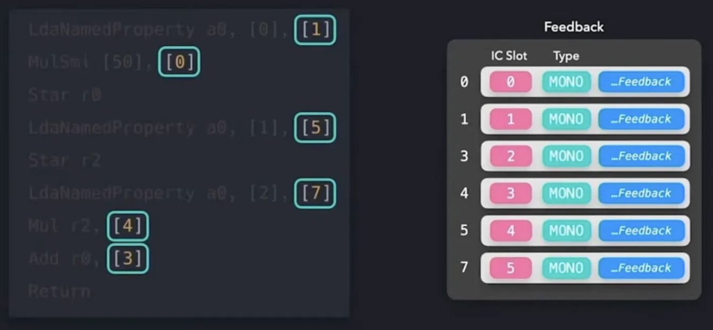

# V8 Engine

기본적으로 JavaScript Enginge은 자바스크립트를 해석하여 AST(Abstract Syntax Tree, 추상적 구문 트리)를 생성한다. 그리고 AST를 기반으로 인터프리터가 실행할 수 있는 중간 코드(intermediate code)인 byte code를 생성하여 실행한다.



## Parsing

V8 Engine의 parsing 과정은 크게 lexical analysis와 syntax analysis 과정으로 진행. Parsing을 하는 주체인 parser는 각각 lexical analyzer와 syntax analyzer가 존재한다.

### Lexical Analysis

Lexical Analyzer는 소스코드를 문자 단위로 하나하나 스캔하며 공백 단위로 분할하여 이를 token으로 분할.

### Lexical Analysis

Syntax Analyzer는 parsing하여 분해한 token을 분석하고, syntax 규칙에 따라 계층화 + 그룹화를 통해 AST를 생성한다.

## Ignition + TurboFan Pipeline

### Ignition: Generate Bytecode

V8의 Ignition의 bytecode compiler가 AST를 byte code로 컴파일한다. 이후 Ignition의 Interpreter가 bytecode를 한 줄씩 읽으며 실행시킨다. (compiler와 interpreter 두 역할을 수행)

:::info
Byte code는 machine code를 추상화 한 것이다. 따라서 컴파일시 machine code로의 변환이 매우 빠르다.
:::

byte code는 CPU Architecture와 독립적인 코드이며, Interperter인 Ignition은 한 줄씩 읽으며 바로 실행이 가능한데, 어떻게 그것이 가능한가?

### TurboFan: Macro Assembly Instruction of bytecode for Ignition

Byte code에서 `LdaSmi`, `Add` 등은 CPU 아키텍쳐에 따라 이해할 수 있는 어셈블리어의 opcode로 변환이 필요하다. TurboFan은 컴파일러로서 **여러 CPU 아키텍쳐와 호환**되어 1:1로 맵핑되는 어셈블리어가 내재되어있다.

TurboFan은 명령어를 대상 아키텍쳐로 컴파일하여 low-level 명령어를 선택한다. 따라서 코드베이스에 최소한의 새로운 machine code만 추가되며 Byte code 명령어를 실행하고, 낮은 오버헤드 방식으로 나머지 V8 Virtual Machine과 상호작용할 수 있는 고도로 최적화된 인터프리터 코드가 생성된다.

### Ingition: Interpretation Procedure

```javascript
function add10(n) {
	const x = 10;
	return x + n;
}

console.log(add10(5));
```

```bash
$ node --print-bytecode --print-bytecode-filter=add10 index.js

[generated bytecode for function: add10 (0x1867f4fe2179 <SharedFunctionInfo add10>)]
Bytecode length: 9
Parameter count 2
Register count 1
Frame size 8
OSR urgency: 0
Bytecode age: 0
 1578 S> 0x1867f4fe3450 @    0 : 0d 0a             LdaSmi [10]
         0x1867f4fe3452 @    2 : c4                Star0
 1586 S> 0x1867f4fe3453 @    3 : 0b 03             Ldar a0
 1595 E> 0x1867f4fe3455 @    5 : 39 fa 00          Add r0, [0]
 1599 S> 0x1867f4fe3458 @    8 : a9                Return
Constant pool (size = 0)
Handler Table (size = 0)
Source Position Table (size = 11)
0x1867f4fe3461 <ByteArray[11]>
```

Ignition의 Interpretation 과정. accumulator(register)에서 I/O 작업이 수행된다.

1. LdaSmi [10]
   `Ld`: `Load`, `a`: accumulator , `Smi`: Small integer
   > accumulator에 상수 값 10을 로드
2. Star0
   `St`: `Store`, `ri`: `i`번째 register
   > 0번째 register에 accumulator에 있는 값을 저장
3. Ldar a0
   `ai`: `add10(n)`의 `i`번째 argument
   > add10 함수의 첫번째 argument에 있는 값을 accumulator에 로드
4. Add r0, [0]
   [0]: 피드백 벡터의 인덱스
   > accumulator에 0번째 register에 있는 값을 더함
5. Return
   > accumulator에 있는 값을 return

### TurboFan Optimize

V8의 Ignition은 byte code를 실행하며 Profiler를 통해 **반복되는 함수나 객체가 사용되는지** 정보를 수집한다.
이렇게 수집한 profiling data, byte code를 TurboFan에 넘기며, 만일 바이트 코드가 반복 실행이 많이 되어서 Ignition이 뜨거워졌다면 TurboFan이 **optimized machine code**를 생성 및 실행시켜서 Ignition의 쿨링 팬과같은 역할을 한다.

이처럼 V8 Engine은 소스코드를 한줄씩 변환하는 **Interpreter(Ignition) 방식**과 소스코드를 런타임에 기계어로 변환하는 **Compile(TurboFan) 방식**이 혼합된 **JIT(Just In Time Compilation)**을 사용한다.

#### Hidden Class 기법

JS 엔진에서 JS 객체의 Value에 접근하기 위해서는 내부의 key를 찾고, Property attributes에 접근하여 value를 로드하는 과정을 거쳐야한다.


`Property attributes`는 프로퍼티의 고유 속성이다. Value, Writeable, Enumerable, Configurable는 ECMAScript의 스펙이다.

```javascript
const obj = {
	x: 1,
	y: 1,
};

for (let prop in obj) {
	const propDescriptor = Object.getOwnPropertyDescriptor(obj, prop);
	console.log(
		`Property: ${prop}, Attributes: ${JSON.stringify(propDescriptor)}`
	);
}
// Property: x, Attributes: {"value":1,"writable":true,"enumerable":true,"configurable":true}
// Property: y, Attributes: {"value":1,"writable":true,"enumerable":true,"configurable":true}
```

만약 두 개의 객체가 비슷한 형태(Shape)를 가질 경우, a와 b에 대한 객체 각각 따로 메모리에 할당을 해줘야한다. 이로 인해 메모리 낭비가 발생한다.

```javascript
const a = {
	x: 1,
	y: 1,
};

const b = {
	x: 3,
	y: 4,
};
```


따라서 `Shape`인스턴스를 하나 생성한 후에, JS 객체는 `shape` 인스턴스를 거쳐 Property information에 접근하고, offset으로 프로퍼티의 Value를 찾을 수 있다.
`Shape`개념을 도입하여 위의 사진에 `property attributes`가 `property information`으로 변경되었다. `offset`으로 각 객체의 프로퍼티 값을 찾을 수 있다.

하지만 javascript는 동적 타입 언어이기 때문에 객체 안의 property의 개수나 크기가 정해지지 않는다. 따라서 객체가 변경될 때 마다 여러 shape 인스턴스를 만드는 것은 메모리 낭비로 이어진다.

```javascript
// empty
let o = {};

// shape (x)
o.x = 5;

// shape (x, y)
o.y = 6;
```

JS 객체는 마지막으로 변경된 Shape를 가리키고, 이전의 객체에 추가되었던 프로퍼티의 key를 찾아 링크를 타고 참조할 수 있다. 이를 "Transition Chain"이라고 한다.



또한 현재의 프로퍼티의 Key는 다르지만, 이전에 동일한 shape를 가졌던 객체도 아래와 같은 구조로 나타난다. 이전에는a, b모두 빈 객체였기 때문이다. 이것을 'Transition Tree' 라고 부른다.



:::info
따라서 `Hidden Class`는 **객체의 메모리를 줄이는** 핵심적인 최적화 기법이다.
:::

#### Inline Caching (ICs) 기법

`Inline Caching`은 주로 **반복적인 코드**나 **용량이 큰 함수**가 최적화 우선순위이다.

`f(a)`함수를 호출하면, 해당 함수를 찾기 위해 Call Stack을 참조한 다음 `function f(a) {...}` 함수 안의 코드에 대한 객체 등을 찾기위해 또 Heap 영역을 참조하게 된다.

이런 접근에 대한 시간을 줄이기 위해 **함수 호출부에 함수 구현부를 삽입하는 방식**이다. 따라서 실행 속도를 최적화하는데 핵심적인 기법이다.

```javascript
function getX(o) {
	return o.x;
}

getX({ x: "a" });
```

TurboFan은 Inline Cache에 있는 데이터를 `Feedback`이란 데이터 구조에 저장한다.


- Byte code에서 `[0]`은 Feedback의 vector의 index이다.
- Byte code가 처음 실행하여 인라인 캐싱을 수행할 지 말지 결정하는 알고리즘을 충족하면, Feedback에 해당 바이트 코드에 대한 정보를 저장한다.
- 이후 해당 바이트 코드에서 feedback vector의 index가 있다면, `[i]`를 통해 Feedback으로 참조하여 인라인 캐싱된 machine code를 실행한다.



### TurboFan Deoptimize

컴파일된 코드가 동적 변환이 발생한다면, 다시 byte code로 전환해야하기 때문에 deoptimize가 발생한다.
Ignition이 바이트 코드로 다시 전환하기 때문에, deoptimize가 발생된다면 비용이 꽤나 들 수 있다.

## 3줄 요약

- V8은 JS 코드를 Parser를 통해 AST로 변환시키고, Ignition을 이용해 byte code를 생성한다.
- 코드의 중복 사용 등 최적화가 필요할 때 TurboFan을 통해 최적화된 machine code로 컴파일 한다.
- 따라서 V8 Engine은 소스코드를 한줄씩 변환하는 **Interpreter(Ignition) 방식**과 소스코드를 런타임에 기계어로 변환하는 **Compile(TurboFan) 방식**이 혼합된 **JIT(Just In Time Compilation)**을 사용한다 할 수 있다.

## 참고문서

- https://medium.com/@devjohnpark/v8-engine-deep-dive-ad664bc4ab43
- https://medium.com/dailyjs/understanding-v8s-bytecode-317d46c94775
- https://docs.google.com/presentation/d/1OqjVqRhtwlKeKfvMdX6HaCIu9wpZsrzqpIVIwQSuiXQ/edit#slide=id.g1453eb7f19_5_383
