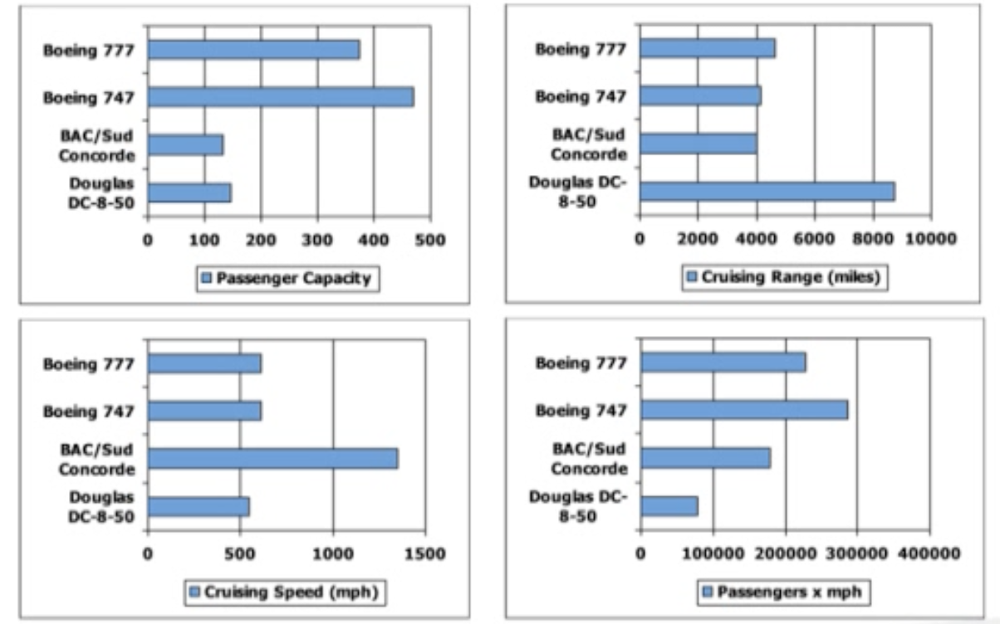
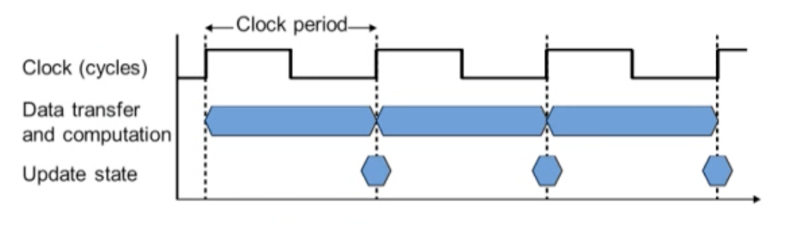
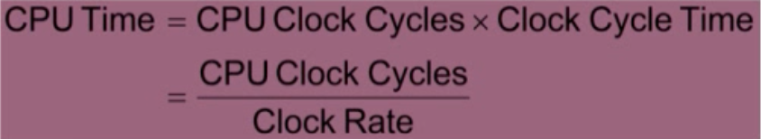

# Computer Abstractions and Technology

## Moore's Law

하나의 싱글 칩에 들어갈 수 있는 트랜지스터의 수가 매년 2배씩 늘어나는 법칙

## What You Will Learn

- How Programs are translated into the machine language
- The hw/sw interface
- What determines program performance
- How hardware designers imporve performance
<!-- - What is parallel processing -->

## Eight Great Ideas in Computer Architecture

1. Design for **Moore's Law**
2. Use **abstraction** to simplify design design
3. Make the common cast fast
4. Performance via **parallelism**
5. Performance via **pipelining**
6. Performance via **prediction**
7. **Hierarchy** of memories
8. **Dependability** via redundancy (redundancy를 통한 안정성 / 신뢰성 획득)

## Below Your Program

- Application software
  - high-level language로 작성됨
- System software
  - Compiler: HLL code > machine code로 translate
  - Operating System
- Hardware
  - Processor, memory, I/O controllers

## Levels of Program Code

- High-level language
  - Level of abstraction closer to problem domain
- Assembly language
  - **Textual representation** of instructions
- Hardware representation
  - Binary digits (bits)
  - Encoded instructions and data

## Under the Covers

### Inside the Processor(CPU)

- Datapath: performs operations on data
- Control: sequences datapath, memory, ...
- Cache memory
  - Small fast SRAM memory for immedicate access to data

### A Safe Place for Data

- Volatile main memory(휘발성 메인 메모리, DRAM)
  - Loses instructions and data when power off
- Non-volatile secondary memory memory(저장장치, storage)
  - Magnetic disk
  - Flash Memory
  - Optical

### Networks

- Communication, resource sharing, nonlocal access
- Local area network (LAN): Ethernet
- Wide area network (WAN): the Internet
- Wireless network: WIFI, Bluetooth

## Technologies for Building Processors and Memory

## Performance

### Defining Performance

- 어떤 항공기가 가장 좋은 performance를 가지고 있나?

- performance를 어떻게 정의하냐에 따라 다르기 때문에, performance를 잘 정의하는 것이 중요하다.

### Response Time and Throughput

- Response time(latency)
  - How long it takes to do a task(작업 시간)
- Throughput
  - Total work done per unit time(단위 시간 당 작업의 양)
    - e.g., tasks/transactions/... per hour (시간당 task, transaction 수)
- How are response time and throughput affected by
  - Replacing the processor with a faster version? : responsetime 감소, throughput 증가
  - Adding more processors? : throughput만 증가
- We'll focus on **response time** for now... (지금 시점부터는 response time에 집중)

### Relative Performance(상대)

- Define Performance = 1 / Execution Time
- "X is n time faster than Y"
- Performance(x) / Performance(y) = Execution time(y)/Execution time(x) = n
- Ex. time taken to run a program
  - 10s on A, 15s on B
  - Execution Time(B) / Execution Time(A) = 15 / 10 = 1.5
  - S A is 1.5 times faster than B

### Measuring Execution Time

- Elapsed time
  - Total response time, including all aspects(아래를 다 고려한 전체 걸리는 시간)
    - Processing, I/O, OS overhead, idle time
  - Determines **system performance**
- CPU time
  - Time spent processing a given job(주어진 작업을 실제 실행하는 시간)
    - Discounts I/O time, other jobs' shares
  - Comprises **user CPU time** and **system CPU time**
  - Diffrent programs are affected differentyl by CPU and system performance

### CPU Clocking

- Operation of digital hardware governed by a constant-rate clock

- 하나의 Clock period는 rising edge, falling edge 하나로 구성되어있음

- Clock period: duration of a clock cycle
- Clock frequency(rate): cycles perseconds

- CC = 1 / CR

### 중간 정리

- Performance는 throughput과 response time으로 정의된다.

### CPU Time

- Performance improved by
- Reducing number of clock cycles
- Increasing clock rate
- Hardward designer must often trade off **clock rate** against **cycle count**(clock rate는 cycle count와 비례)
