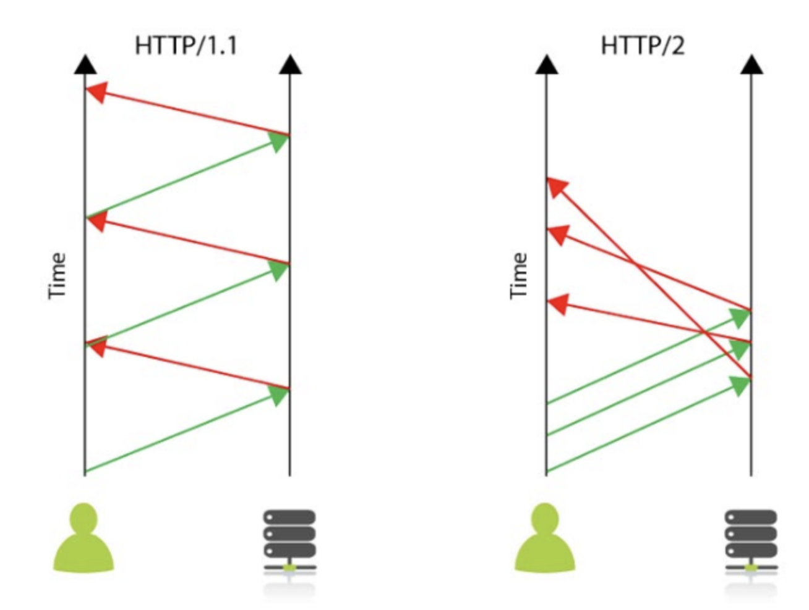
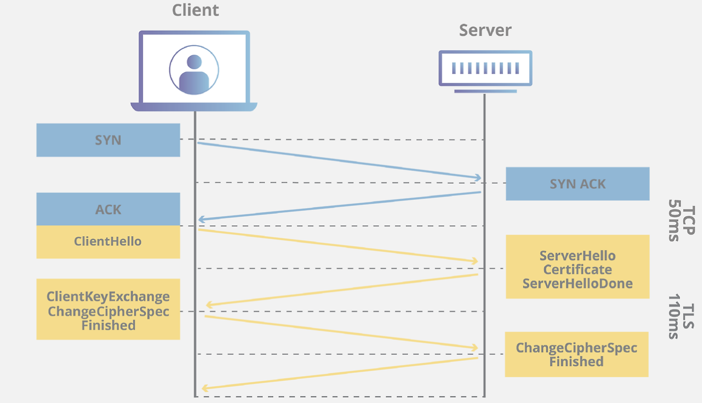

# HTTP

## HTTP란?

HTTP는 Hyper Text Transfer Protocol의 약자로, 인터넷 상에서 데이터(Hyper Text)를 주고 받기 위해서(Transfer) 서버/클라이언트 모델을 따르는 프로토콜. 주로 웹 브라우저와 웹 서버간의 커뮤니케이션을 위해서 디자인 되었다.

HTTP는 주로 TCP를 사용하고, 2020년부터 도입된 HTTP/3에서는 UDP를 사용한다. 또한 기본 포트로 80번을 사용한다는 특징이 있다.

:::info

- 서버/클라이언트 모델: 클라이언트가 요청을 생성하기 위한 연결을 연다음 응답을 받을때 까지 대기하는 전통적인 방식
- 프로토콜: 컴퓨터 내부 또는 컴퓨터 사이에서 데이터의 교환 방식을 정의하는 규칙 체계
  :::

### HTTP/1.1

- HOL Blocking: 네트워크에서 같은 큐에 있는 패킷이 첫 번째 패킷에 의해 지연될 때 발생하는 성능 저하 현상.  
  HTTP/1.1의 request-response쌍은 항상 순서를 유지하고 **동기적으로 수행**된다. 이는 이전의 요청이 처리되지 않는다면 그 다음 요청을 보낼 수 없다는 것을 의미한다.

### HTTP/2

2015년에 만들어진 새로운 버전의 HTTP. HTTP/1.1 제작자가 예상하지 못한 몇 가지 문제를 해결하며, HTTP/1.1보다 훨씬 빠르고 효율적이다.

- 멀티 플렉싱 지원: HTTP/1.1은 리소스를 차례로 로드하므로 한 리소스를 로드할 수 없는 경우 그 뒤에 있는 다른 모든 리소스가 차단된다. 반면 HTTP/2는 단일 TCP 연결을 사용하여 한 번에 여러 데이터 스트림을 보낼 수 있으므로 한 리소스 때문에 다른 리소스가 차단되지 않는다.
- 서버 푸시: 클라이언트가 요청하기 전에 서버가 클라이언트에 콘텐츠를 **푸시**가 가능하도록 한다.
- 헤더 압축: HTTP/2는 HTTP 헤더 패킷에서 중복 정보를 제거하는 HPACK이라는 고급 압축 방법을 사용하기 때문에 더 빨리 응답이 로드될 수 있다.

### HTTP/3

HTTP/1.1과 HTTP/2는 TCP로 통신하는 것과 달리, HTTP/3은 UDP기반의 QUIC 프로토콜을 사용하여 통신한다.

HTTP/3의 장점은 아래와 같다

- Zero RTT(Round Trip Time)
- 패킷 손실에 대한 빠른 대응
- 사용자 IP가 바뀌어도 연결이 유지

## HTTP의 문제점

HTTP 서버는 기본 80번 포트에서 서비스를 대기하고 있으며, 만약 웹 브라우저가 80번 포트를 연결하여 데이터를 요청하면 서버는 요청에 해당하는 데이터(Hyper Text)를 전송하면서 응답하게 된다.

이 과정에서 누군가가 네트워크 신호를 가로채는 경우, 데이터는 외부에 그대로 노출되어 데이터가 도난당할 수 있다는 문제점이 존재한다. 이러한 보안 취약점을 해결하기 위해 HTTPS가 등장했다.

## HTTPS

HTTPS는 HTTP에서 Secure socket layer, 즉 데이터 전송 과정에서 보안이 추가된 프로토콜이다. 데이터 전송시 텍스트를 사용하는 대신, SSL이나 TLS 프로토콜을 통해 세션 데이터를 암호화하기 때문에 데이터의 보호를 보장한다. 그리고 HTTP와는 다르게 기본 포트로 443번을 사용한다는 특징이 있다.

따라서 HTTPS를 사용하면 클라이언트가 금융 활동 이나 온라인 쇼핑을 할 때 민감한 개인 정보를 서버와 안전하게 주고 받을 수 있게 됩니다.

:::info

- SSL, TLS? : SSL(Secure Sockets Layer), TSL(Transport Layer Security)는 네트워크에 통신 보안을 제공하기 위해 설계된 암호 규약이다. 이때 TLS는 SSL이 표준화되면서 바뀐 이름. 따라서 TLS안에 SSL이 있다 할 수 있다.
  :::

### 대칭키 vs 공개키

#### 대칭키 암호화 방식

암호화에 사용되는 키와 복호화에 사용되는 키가 **동일**한 암호화 기법

암호화된 내용을 받는 상대가 암호를 복호화하기 위해서 대칭키의 공유가 필요한데, 대칭키가 유출되면 키를 획득한 사람은 누구나 복호화를 할 수 있다는 단점이 있다.

#### 공개키 암호화 방식

두개의 키를 갖게 되는데 A키를 사용해 암호화를 하면 B키로 복호화를 할수 있고, B키로 암호화를 하면 A키로 복호화를 할 수 있는 암호화 방식

키A를 통해 암호화한 내용은 키A를 이용해 복호화 하는 것은 불가능하고, 키A와 쌍을 이루는 키B를 사용해야만 복호화가 가능

이 방식은 공개키가 유출된다 하더라도, 공개키를 이용해서는 오직 암호화만 가능하고 복호화는 서버의 비밀키(비공개키)로만 가능하기 때문에 안전한 방식.

### SSL 인증서

SSL 인증서는 클라이언트가 접속한 서버가 신뢰 가능한 서버임을 보장하고, SSL 통신에 사용할 공개키를 클라이언트에게 제공하는 기능을 가지고 있다.

### SSL Handshake

- 서버와 클라이언트가 주고받을 데이터의 **암호화 알고리즘을 결정**한다.
- 서버와 클라이언트가 주고받을 데이터의 암호화를 위한 **동일한 대칭키를 얻는다.**

TCP 프로토콜의 3-way handshake를 통해 연결을 생성한 후, SSL Handshake를 진행한다.

1. client → server 연결을 시도
2. server → client 응답
3. server → client (Certificate, Server Key Exchange, Server Hello Done)
4. client 에서 server 의 SSL 인증서 검증
5. client → server 대칭키(비밀키) 전달 (Client Key Exchange, Change Ciper Spec)
6. Server / Client SSL Handshake Finished
