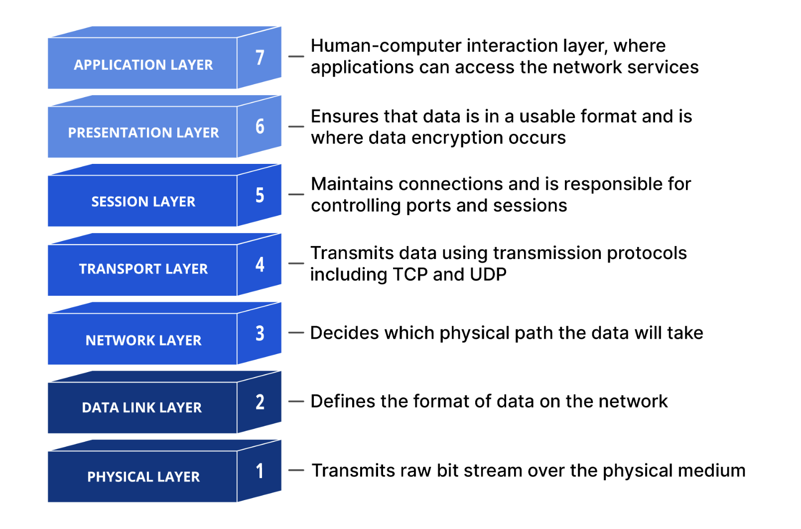

# OSI 7 계층

네트워크에서 통신이 일어나는 과정을 7단계로 나눈 것

OSI 모델의 7가지 추상 계층은 탑 다운 방식으로 아래와 같이 정의할 수 있다.

## 7. 응용 프로그램 계층

- 최종 목적지로서 HTTP, FTP, SMTP, POP3, IMAP, Telnet 등과 같은 프로토콜이 있다.
- 사용자의 데이터와 직접 상호 작용하는 유일한 계층이다.

## 6. 프레젠테이션 계층

- 주로 데이터를 준비하는 역할을 하여 애플리케이션 계층이 이를 사용할 수 있게 한다.
- 즉, 계층 6은 애플리케이션이 소비할 수 있도록 데이터를 프레젠테이션(표현)한다.
- 데이터의 변환, 암호화, 압축 등의 동작이 이루어진다.

## 5. 세션 계층

- 두 기기 사이의 통신을 시작하고 종료하는 일을 담당하는 계층
- TCP/IP 세션을 만들고 없애는 책임을 진다.

## 4. 전송 계층

- 두 기기 간의 종단 간 통신을 담당
- 전송 계층 프로토콜에는 전송 제어 프로토콜(TCP) 및 사용자 데이터그램 프로토콜(UDP)이 있다.

## 3. 네트워크 계층

- 서로 다른 두 네트워크 간 데이터 전송을 용이하게 하는 역할을 한다.
- 이 계층의 대표적인 장비는 라우터이며, 2계층의 장비인 스위치에 라우팅 기능을 장착한 Layer 3 스위치도 있다.

:::info
L3 Switch와 Router의 차이?
: 패킷 전송 구조, 네트워크 구조가 다르지만 라우팅의 측면에서 거의 차이가 없다봐도 무방하다.
:::

## 2. 데이터 연결 계층

- 물리계층을 통해 송수신되는 정보의 오류와 흐름을 관리하여 안전한 정보의 전달을 수행할 수 있도록 도와주는 역할을 한다.
- MAC 주소를 가지고 통신하며, 이 계층에서 전송되는 단위를 프레임이라 한다.
- 대표적인 장비로는 브릿지, 스위치 등이 있다.
- 주소 값은 물리적으로 할당 받는데, 이는 네트워크 카드가 만들어질 때부터 맥 주소(MAC address)가 정해져 있다는 뜻이다.

## 1. 물리적 계층

- 통신 단위는 bit, 1과 0의 문자열인 비트 스트림으로 변환되는 계층
- 단지 데이터의 전달만 담당하며, 송신 또는 수신하는 데이터의 검증과 에러 여부 등은 관심사가 아니다.
- 케이블, 리피터, 스위치 등 데이터 전송과 관련된 물리적 장비가 포함된다.

## 각 Layer의 처리 데이터의 단위

- 응용 프로그램 계층 : message
- 전송 계층 : segment or datagram
- 네트워크 계층 : packet
- 데이터 연결 계층 : frame
- 물리적 계층 : bit

## Address Resolution Protocol (ARP)

- 같은 네트워크 대역에서 통신을 하기 위해 필요한 MAC 주소를 IP 주소를 이용해서 알아내는 프로토콜

### ARP의 통신과정

1. 상대방의 IP를 이용해 MAC주소를 알아오기 위해 Header에 이더넷을 붙여 encapsulation 해서 보내게 된다.
2. 2계층 장비가 2계층까지만 decapsulation 한 후 브로드 캐스트 맥주소임을 확인하고, 같은 네트워크 대역에 있는 모두에게 "이더넷 + ARP" 패킷을 보내게 된다.(broadcast)
3. 이를 받은 모두는 decapsulation을 통해 이더넷 프로토콜을 열어 본다.
4. 3계층도 열어보게 되고 본인의 ip 주소와 목적지 ip 주소가 일치하지 않는 패킷은 버리고 일치하는 것은 응답 프로토콜을 만들어 주게 된다.
5. 응답 프로토콜의 operation code는 2번이 되고 출발지 MAC주소에 자신의 MAC 주소를 쓰고 목적지 맥주소를 원래 원래의 노드로 써서 보내주게 된다.(response)
