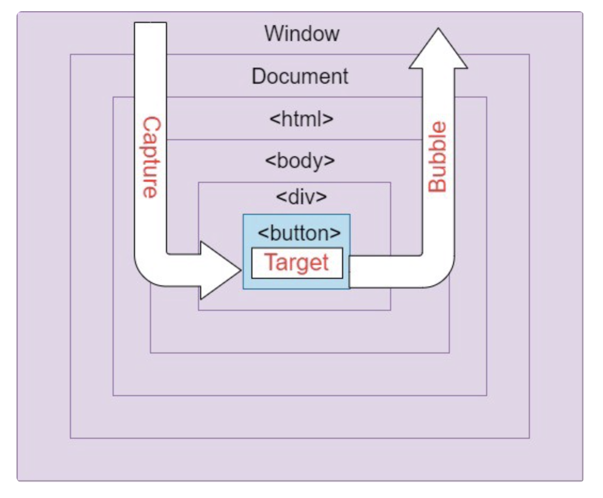

# 버블링과 캡쳐링

표준 DOM 이벤트에서 정의한 이벤트 흐름엔 3가지 단계가 있다.

1. 캡처링 단계 – 이벤트가 하위 요소로 전파되는 단계
2. 타깃 단계 – 이벤트가 실제 타깃 요소에 전달되는 단계
3. 버블링 단계 – 이벤트가 상위 요소로 전파되는 단계




## 버블링

한 요소에 이벤트가 발생하면, 이 요소에 할당된 핸들러가 동작하고, 이어서 부모 요소의 핸들러가 동작한다. 최종적으로 가장 최상단의 조상 요소를 만날 때까지 이 과정이 반복되면서 요소 각각에 할당된 핸들러가 동작한다.

```html
<form onclick="alert('form')">FORM
  <div onclick="alert('div')">DIV
    <p onclick="alert('p')">P</p>
  </div>
</form>
```
예를 들어 해당 코드에서는 P → DIV → FORM 순으로 이벤트가 버블링된다.

:::info
이벤트가 제일 깊은 곳에 있는 요소에서 시작해 부모 요소를 거슬러 올라가며 발생하는 모양이 마치 물속 거품(bubble)과 닮았기 때문에, 버블링이라 부른다.
:::


## 캡쳐링

이벤트는 최상위 조상에서 시작해 아래로 전파된다.

```html
<form>FORM
  <div>DIV
    <p>P</p>
  </div>
</form>
```
만약 `<p>`를 클릭한다면, HTML → BODY → FORM → DIV 와 같은 순서로 이벤트가 캡쳐링된다.

## 이벤트 전파 중단

### stopPropagation

`stopPropagation`을 이용하여 하나의 이벤트에 대한 전파를 중단할 수 있다.

```html
<body onclick="alert(`버블링은 여기까지 도달하지 못합니다.`)">
  <button onclick="event.stopPropagation()">클릭해 주세요.</button>
</body>
```

:::caution
꼭 필요한 경우를 제외하곤 버블링을 막으면 안된다. 예를 들어 특정 이벤트의 버블링을 중단시켰지만, 전체 클릭 이벤트를 감지하여 행동 패턴 분석을 하는 코드를 추가하였다면 해당 이벤트의 행동은 logging하지 못하기 때문. 이벤트 버블링을 막아야 하는 경우는 거의 없다.
:::

### stopImmediatePropagation

`stopPropagation`은 동일 요소의 이벤트 핸들러가 여러 개 일때는 해당 메서드를 호출한 이벤트의 전파만 막는다.
여러 개의 이벤트의 전파를 모두 막기 위해서는 `stopImmediatePropagation`를 사용할 수 있다.

```javascript
child.addEventListener("click", (e) => {
  if(조건)
    e.stopImmediatePropagation()
  print('child')
})

child.addEventListener("click", (e) => {
  print('child 2')
}) // 해당 이벤트의 전파도 중단됨
```

### preventDefault

`preventDefault`는 이벤트 전파 뿐 아니라, 기본 이벤트의 동작을 중단시킨다.

예를 들어 `<a href="url">`의 링크 기능, `<form>`태그의 submit 이벤트를 취소할 수 있다.

## 이벤트 위임

```html
<ul>
    <li>Item 1</li>
    <li>Item 2</li>
    <li>Item 3</li>
    <li>Item 4</li>
</ul>
```
이벤트 위임을 이용하면 해당 코드에서 `<li>`에 eventListner를 하나하나 달 필요없이, 버블링을 이용해 `<ul>` 요소에만 이벤트를 등록하면 모든 `<li>`에 이벤트가 전파되기 때문에 중복을 줄일 수 있다.