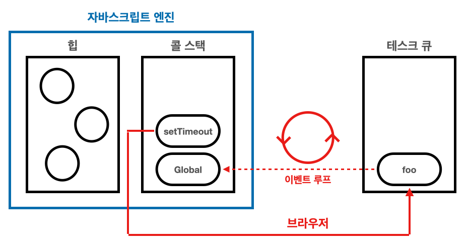

# 이벤트 루프와 태스크 큐

## 이벤트 루프와 브라우저 환경



### 콜 스택 (= 실행 컨텍스트 스택)

함수를 호출하면 함수 실행 컨텍스트가 순차적으로 콜 스택에 푸시되어 순차적으로 실행된다.

### 힙

객체가 저장되는 메모리 공간이다. 실행 컨텍스트는 힙에 저장된 객체를 참조한다.
객체는 크기가 정해져 있지 않기 때문에, 할당해야 할 메모리 공간의 크기를 런타임에 결정(동적할당) 해야한다. 따라서 힙은 **구조화가 되어있지 않다**는 특징이 있다.

:::note
자바스크립트 엔진은 단순히 테스크가 요청되면 작업을 순차적으로 실행만 하고, 비동기 처리에서 이를 제외한 모든 처리는 브라우저 또는 Node.js가 담당한다.
:::

### 태스크 큐

비동기함수의 콜백 함수(setTimeout, setInterval 등) 또는 이벤트 핸들러가 일시적으로 보관되는 영역이다.

### 이벤트 루프

콜 스택에 현재 실행중인 실행 컨텍스트가 있는지, 태스크 큐에 대기중인 함수가 있는지 반복해서 확인한다.
만약 콜 스택이 비어있고, 태스크 큐에 대기중인 함수가 있다면 이벤트 루프는 순차적으로 태스크 큐에 대기중인 함수를 콜 스택으로 이동시킨다.
:::note
태스크 큐에 일시적으로 보관된 함수들은 비동기 처리 방식으로 동작한다.
:::

```ts
function foo() {
	console.log("foo");
}
function bar() {
	console.log("bar");
}

// highlight-start
setTimeout(foo, 3 * 1000);
bar(); // bar, (3초 후), foo
// highlight-end
```

> 브라우저에서 위 예제는 다음과 같이 동작한다.

1. 전역 코드가 실행되면 먼저 setTimeout 함수가 <mark>**호출**</mark>되며 콜 스택에 푸시되어 현재 실행중인 실행 컨텍스트가 된다.
2. setTimeout 함수가 <mark>**실행**</mark>되면 콜 스택에서 팝된다.
3. **(브라우저)** 타이머를 설정하고 타이머의 만료를 기다린다. 이후 타이머가 만료된다면 콜백 함수 foo를 **태스크 큐에 등록**한다.  
   **(자바스크립트 엔진)** 다음으로 bar함수가 <mark>**호출**</mark>되어 실행 후 종료되어 콜 스택에서 팝된다.
4. 전역 코드 실행이 종료되고, 콜 스택에 아무런 실행 컨텍스트도 존재하지 않게된다.
5. **이벤트 루프**에 콜 스택이 비어있음이 감지되고 태스크 큐에서 대기중인 콜백 함수 foo가 **이벤트 루프에 의해 콜 스택에 푸시**되며, **실행 후 종료**되어 콜 스택에서 팝된다.

## 정리

- setTimeout의 콜백 함수는 태스크 큐에 푸시되어 대기하다 **콜 스택이 비게되면 이벤트 루프가 이를 감지**하고 **콜백 함수를 콜 스택에 푸시하여 실행**된다.
- 자바스크립트(엔진)이 싱글 스레드 방식으로 동작하는 것이고, 브라우저는 멀티 스레드로 동작한다.
