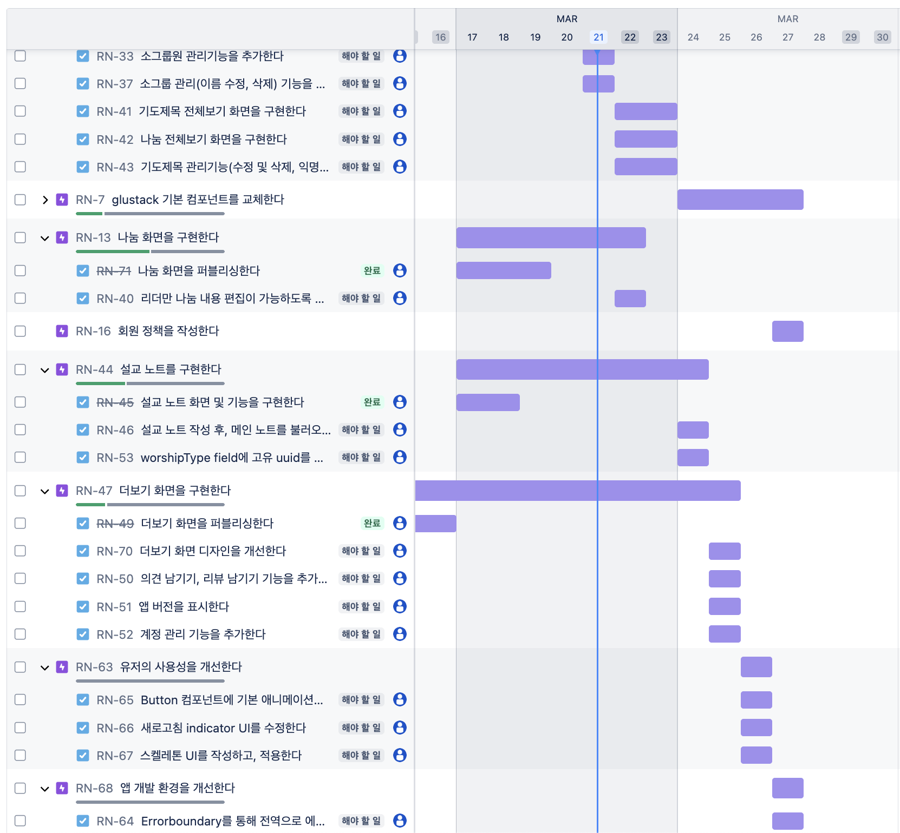
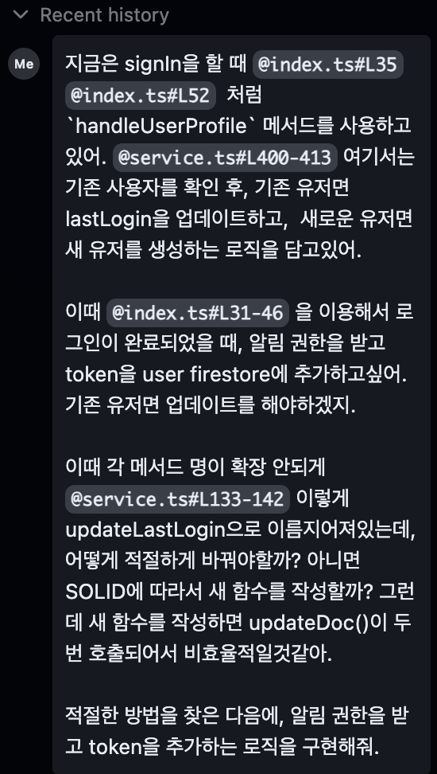

# 2025.03 4주차


## 3월 20일

- 나눔 노트 화면 구현 및 api 설계, 연결
- Avatar 컴포넌트 구현, AvatarGroup도 구현 + 클릭시 애니메이션과 함께 펼쳐지는 기능도 구현
- 기도제목 생성 및 조회, 좋아요 기능 구현(api는 llm이 거의 다 짜줌. 컨펌만)
- 폴더 구조를 domain별로 `features/`에 분리.

### Keyboard 관련 동작

- 실제 keyboard를 띄우니까 키보드에 ui가 묻힘
- 해결하기위해 keyboard-view를 만들어서, 사용할 때마다 감싸서 사용할 수 있도록 함. > 나중에 리팩터링 할 때 HOC로 만들어보는것도 괜찮을듯?
- KeyboardAvoidingView를 직접 커스텀하여 작성

```tsx
const KeyboardAvoidingView = ({ children }: KeyboardAvoidingViewProps) => {
  return (
    <RNKeyboardAvoidingView
      behavior={Platform.OS === 'ios' ? 'padding' : 'height'}
      style={{ flex: 1 }}
      keyboardVerticalOffset={Platform.OS === 'ios' ? 12 : 0}
    >
      <KeyboardDismissView>
        {children}
      </KeyboardDismissView>
    </RNKeyboardAvoidingView>
  );
};
```

### Group API 설계 및 적용

- group api 설계하는데 계속 머리 싸매면서 고민..
- prayer-request에서 설계한 api 함수 및 폴더 구조대로 auth도 리팩터링 진행
	- ClientUser, Firestore(server)User type을 매핑
- Group 생성 Flow 화면 구현. onboarding, EmptyHome에서 재사용하도록 컴포넌트를 최대한 분리한 후, 내부 분기처리
- authStore에 `currentGroup`상태를 추가해서 현재 선택된 그룹을 관리
- user에 group을 어떻게 관리할까 고민. users 컬렉션에는 모든 group의 정보가 없어도 된다 판단.
	- `{groupId: string}[]`(`string[]`이 아닌 이유는, 나중에 필요한 필드를 추가할 수 있기에 확장성을 위함)만 저장해두고, 이걸 기반으로 getGroups로 그룹을 가져오도록 구현.

### 남은 작업들

- 그룹 Join 기능 추가
- 기도제목 관리 기능(기도제목 수정, 삭제)

## 3월 21일

### Jira를 다시 사용하다

개발 작업 목록에 해야할 일들이 자꾸 쌓여가서.. 이걸 효율적으로 관리하자



- Expo Go에서 [DevelopmentBuild](https://docs.expo.dev/develop/development-builds/create-a-build)로 변경
	- keyboard-controller 패키지가 expo-go를 지원하지 않기 때문


## 3월 26일

- google login 구현 > iOS 개발환경설정, google-info plist 등..
- google login이 simulator에서 동작 x.. 흰 blank 화면 > 실기기 테스트 필요
- 더보기 화면 기능 구현 > 바이브코딩으로 빠르게 구현 완료
- windsurf 룰을 추가해서, 기존 만들어진 header, toast 등을 사용하고 문체를 적용.
- image picker 이미지도 안떠서 실기기로..
- 회원탈퇴 기능, soft delete하고 계정 자체는 삭제. 계정 살리는거는 고객센터 문의 어쩌구 달려고했지만 레퍼런스를 찾아보니 SNS는 복구 안되고 대부분 아예 지우는거라. firebase authentication 유저 자체는 삭제되고, 새로 가입하는 형식으로!
- 나중에 복구 원하면 새로 가입은 하고, 데이터만 집어넣어주지..
- 회원탈퇴와 useAuthStore 연동(탈퇴하면 auth store 값 초기화)
- onboarding step이 useOnboardingStore과 연동이 제대로 되지 않아서.. 머리 쥐어 짜내다가 결국 성공..ㅎㅎ.. + code로 유저 초대기능 구현
- worshipType이 표시 안되는 문제.. 예전에 batch로직 수정되면서 createdAt을 없앴는데, 이걸 기준으로 sort 쿼리를 조회해서 발생. name으로 쿼리 불러와서 해결.

## 3월 27일

- 개인정보처리방침 작성.. 거의 못하고 어느정도 어떻게 써야하는지는 알겠음.
- skeleton ui 작성, prompt로 딸깍헤서 15분만에 구현. 예전같으면 몇시간은 걸릴 작업을 그냥 ui 베이스로 그려버리고 연동시켜주니까 더 효율적..
- 기타 자잘한 오류:
  - firebase > react-native-firebase로 마이그레이션
- Screen에 Google Analytics 추가

## 3월 28일

- 바이브 코딩 적극적 활용



### 구현 내용 요약

#### 1. FirestoreUser 인터페이스 확장

- FirestoreUser 인터페이스에 `fcmToken` 필드를 추가하여 타입 안전성 확보

#### 2. 새로운 함수 추가

- `updateUserData` 메서드 추가: 여러 필드를 한 번에 업데이트할 수 있는 함수 구현
    - SOLID 원칙에 따라 함수는 단일 책임만 갖도록 설계했으며, 기존 `updateLastLogin` 함수는 그대로 두고, 더 일반적인 업데이트 함수를 별도로 추가

#### 3. 사용자 프로필 처리 메서드 개선

- `handleUserProfile`, `handleExistingUser`, `handleNewUserCreation` 메서드에 FCM 토큰 매개변수 추가
- 기존 사용자의 경우 마지막 로그인 시간과 함께 FCM 토큰 업데이트
- 신규 사용자의 경우 계정 생성 시점에 FCM 토큰 저장

#### 4. 로그인/회원가입 API 함수에 알림 권한 요청 로직 통합

- `signInWithEmail`, `signInWithGoogle`, `signInWithApple`, `signUpWithEmail` 모든 로그인 방식에 알림 권한 요청 및 토큰 저장 로직 추가
- 로그인 성공 직후 알림 권한을 요청하여 사용자 경험 최적화

#### 5. 함수형 접근 방식 유지

- 불변 업데이트 패턴 사용
- 명확한 에러 처리를 통한 안정적인 코드 구현