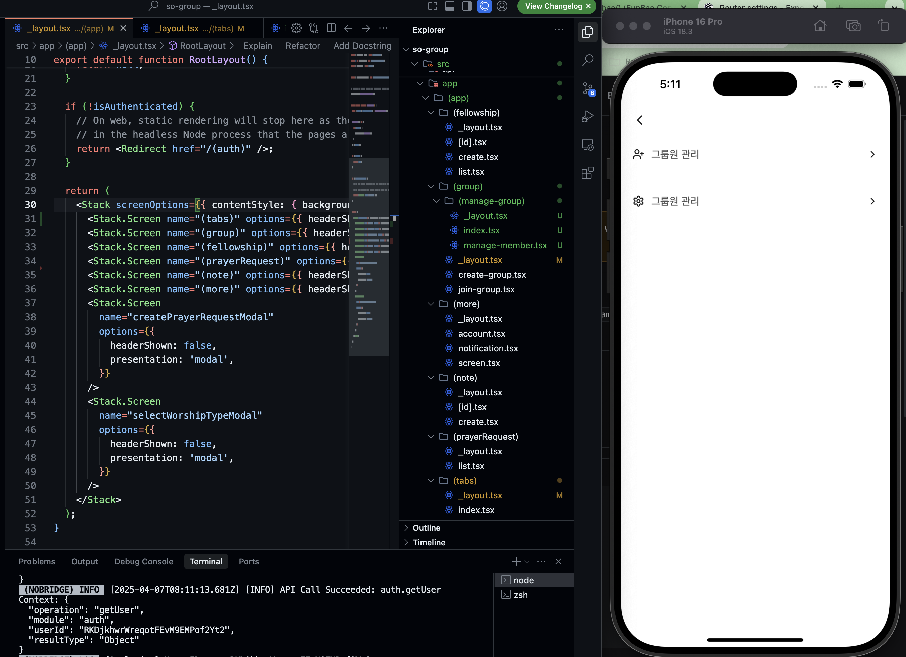
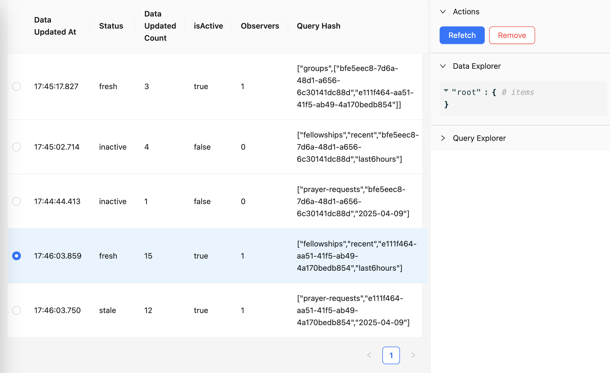

# 2025.04 2주차

- 하위 폴더에 index로 설정하면,  (tabs)/index.tsx를 기본으로 인식하지 않고, 하위 폴더의 index파일을 Home으로 인식하는 문제..



- gorhom/bottom-sheet 내부에서 ScrollView를 사용하는 법 (전체 ScrollView x)
https://stackoverflow.com/questions/76000819/scroll-content-inside-gorhom-bottom-sheet-react-native

- react-native-gesture-handler의 ScrollView 사용
  - 하지만 Android 기기에서는 여전히 scroll이 되지 않음. 추후 해결 필요

- react query devtools을 이용해서 과도하게 fellowship 상태 확인 리렌더링되는 문제를 해결


## 4월 10일

### 소그룹 관리 기능  
- [x] 리더만 소그룹 관리 메뉴 접근 가능하도록  
  - [x] 리더 변경 기능 추가  
- [x] 소그룹 관리 기능 추가  
  - [x] 소그룹 추가 및 삭제 기능 구현  
- [x] 그룹원 목록 BottomSheet 내부 ScrollView 적용  
- [x] 그룹원 삭제시 user의 group도 삭제하도록

### 기능 개선 및 오류 수정  
- [ ] 프로필 수정
	- [x] 텍스트 입력시 튕기는 현상 수정
	- [x] 프로필 수정시 유저가 속한 group의 정보도 변경할 수 있도록 구현
	- [ ] 이미지 설정 기능 추가 (Firebase Cloud 연동?)
- [ ] ErrorBoundary 적용  
  - [ ] SNS 로그인 취소 시 에러 표시하지 않도록 수정 
- [x] 앱 로고 크기 키워서 다시 적용
- [ ] 이메일에서 회원 탈퇴 기능(재인증 bottomsheet) 구현
- [ ] NotificationSettingScreen 오류(업데이트 불가) 수정
- [x] 이름, 닉네임 등 유저정보를 바꾸면 group의 members에도 변경할 수 있도록 로직 추가
- [ ] notification token을 여러개로 관리할 수 있도록 변경
- [ ] 나눔 상태 확인이 과도하게 refetch되는 문제 해결
- [x] 나눔 상세화면에서 나눔 정보 박스 접기 기능 추가
### 앱 출시 준비
- [x] 앱 문구 추가

## 4월 11일

### UI및 UX 개선  
- [ ] BottomSheet  
  - [ ] Software Keyboard 간격 조절 (너무 넓음)
- [x] Apple 로그인 버튼 → 기본 Button 컴포넌트 적용  
- [ ] TextInput 컴포넌트 작성
- [x] 노트 필터링 화면 개선
- [x] Toast 컴포넌트 디자인 및 적용  

### 기능 개선 및 오류 수정  
- [ ] 프로필 수정
	- [ ] 이미지 설정 기능 추가 (Firebase Cloud 연동?)
- [ ] ErrorBoundary 적용  
  - [ ] SNS 로그인 취소 시 에러 표시하지 않도록 수정 
- [ ] 이메일에서 회원 탈퇴 기능(재인증 bottomsheet) 구현
- [x] NotificationSettingScreen 오류(업데이트 불가) 수정
- [ ] notification token을 여러개로 관리할 수 있도록 변경
- [ ] 나눔 상태 확인이 과도하게 refetch되는 문제 해결
- [x] 설교 노트 
	- [x] textinput 반경 늘리기
	- [x] 예배 종류 색상 변경
	- [x] 각 항목 들어갈 때 애니메이션
	- [x] 텍스트 꽉 찰때 하단 공백 추가
### 앱 출시 준비
- [x] 앱 목업 이미지 제작

## 4월 12일

### 고민

> groups/members
> groups/fellowship
> groups/prayer-request

- users/uid - displayName, photoUrl 등이 변경되면, groups에도 변경되어야함.

- 각 groups의 subcollection에는 duplicate해서 데이터를 보관.

- 따라서 firestore batch로 일괄 업데이트를 진행할까 고민.

- 하지만 만약 prayer-request가 1000개가 넘어간다면, 모두 쓰기하는 것은 리소스가 많이 들 것.

- 결론: group에 userId만 넣고, 클라이언트에서 렌더링하도록 수정하기

### 기타 개발 문제

- firebase storage bucket region이 미국으로 되어있어서(Asia는 유료라서 free tier인 미국으로 설정), 3~4초정도 프로필 이미지 업데이트 시간 소요.
- 닉네임만 수정한다하면 이미지는 수정 field에 포함하지 않도록 수정
-> 변경된 필드만 적용할 수 있도록 수정

- note 삭제하는 기능이 없어서 추가

- 알림 설정 하지 않았을 경우, 알림 문구 및 시스템 설정 바로가기 안내 Box 추가
  - vibe coding으로 깔끔하게 코드 분리해서 구현!

```tsx
import { useState, useEffect } from 'react';
import * as Notifications from 'expo-notifications';

/**
 * 알림 권한 상태를 확인하는 훅
 * @returns {boolean | null} 알림 권한 상태 (true: 허용, false: 거부, null: 확인 중)
 */
export function useNotificationPermission() {
	const [hasPermission, setHasPermission] = useState<boolean | null>(null);

	useEffect(() => {
		checkNotificationPermission();
	}, []);

	const checkNotificationPermission = async () => {
		const { status } = await Notifications.getPermissionsAsync();
		setHasPermission(status === 'granted');
	};

	return {
		hasPermission,
		checkNotificationPermission,
	};
}
```
