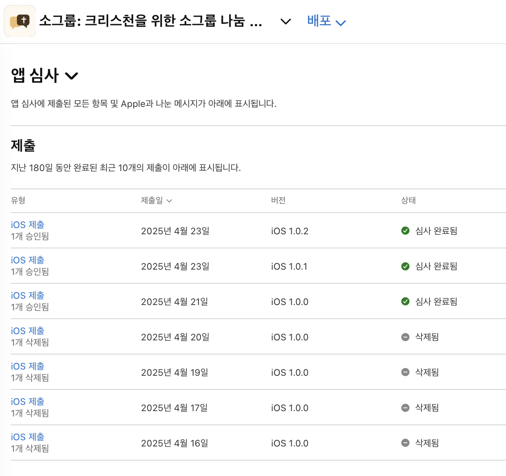
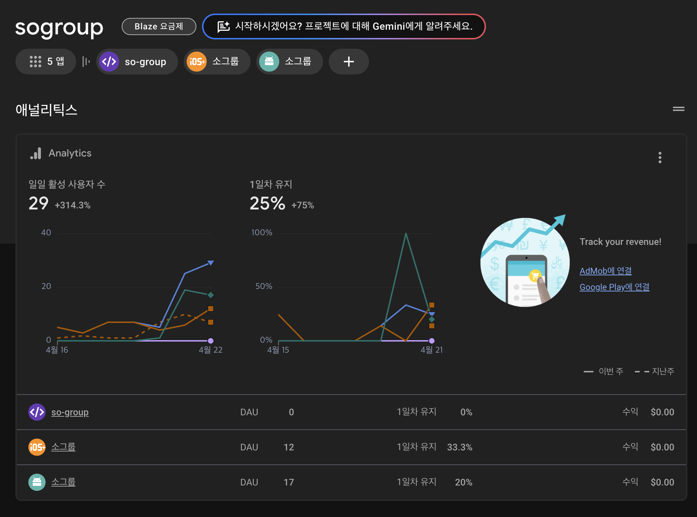

# 2025.04 4주차 - 앱 출시

## 4월 22일

앱 심사에 통과한 후 출시가 되었지만, fcmToken 관리 로직 등등 아직 유저가 앱을 받으면 안되었기 때문에 최대한 빠르게 사용할 수 있을 수준의 기능 개발을 완료해야한다.

### 스레드에 홍보글을 올리다

첫 게시글이라 알고리즘에 우선순위가 높아서, 조회수 5,000이 넘고 반응이 꽤 좋았다. 빨리 앱을 개선하고 앱 심사에 넘겨야겠다는 생각에 12시간동안 거의 쉬지 않고 개발했다.

- 온보딩 과정 개선
  - google login시 profile 이미지 추가
- "undefined 님이 기도제목을 추가했어요." 로 알림이 뜨는 오류 수정
  - members를 collection으로 관리하도록 변경했는데, functions에서는 대응이 안되어서 발생하는 문제.
- android 두번 뒤로가기 누를 경우 앱이 나가지도록 구현
- 개처방, 이용약관 개선

## 4월 23일

- Amplitude 무료 사용량이 있어서, 클릭 등의 이벤트를 수집이 필요한 곳에서만 보내도록 제한
- 실제 나눔 작성 화면에서 profile 이미지가 업데이트 안되는 현상 수정
- 앱 업데이트는 심사 시작 후, 완료까지 3시간 정도 걸렸다.

## 4월 24일

스레드에 앱 출시 홍보 글 작성

- 홍보 후, 유저가 조금씩 는다

- 유저가 사용하고, 다른 유저에게 추천하며 앱 사용자가 느는 선순환을 반복하기 위해 어떻게든 유저의 참여율을 높여야 한다

> 내가 실제 소그룹에서 사용하는 유저라면, 나는 어떤 기능을 원하는가? 어떤 불편함을 가지는가? (유저 페르소나)
> -> 여기에서부터 출발해야한다.

### 앞으로 해야할 것

1. 지금까지 앱 출시까지의 기록 정리하고 올리기
2. 디자인 레퍼런스 많이 찾아보고, 적용할 부분 생각하기
3. 어떤 기능을 가장 먼저 넣어야할지 고민하기(thread에 설문조사 활용)
4. 마케팅

#### 기존 기능 고도화

- 나눔 기능 개선(field를 바꾸면 마이그레이션도 필요)
	- QT, 설교 등 선택지 제공?
	- **나눔 (텍스트로) 내보내기 기능**
	- 나눔 질문 리스트 추가
	- 수정 및 나눔 내용 작성 ui 개선
- 커뮤니티 기능 강화
	- 공지사항, 자유게시판 등 태그로 구분

#### 새 기능 추가

- 설교 노트 디자인 개선, 볼드체 등 rich text 기능
- 소그룹 챌린지 기능(QT, 새벽기도 등 진행률 확인)
- 서비스 추천 기능(주변인에게 추천 독려)

##### 아이디어
- 오프라인에서 그치는 것이 아닌, 온라인을 통한 연결을 새 탭으로 추가
- 성경 추가
	- 설교 노트에서 말씀 불러오기

#### 서비스 개선

- 버그 수정
- 개발자와의 채팅(리스트에 new 표시 추가: 이목 끌기)
- 점검중 화면 추가
- 이용약관 개선

- 다음 배포일은 4/28 월요일 저녁으로 설정

