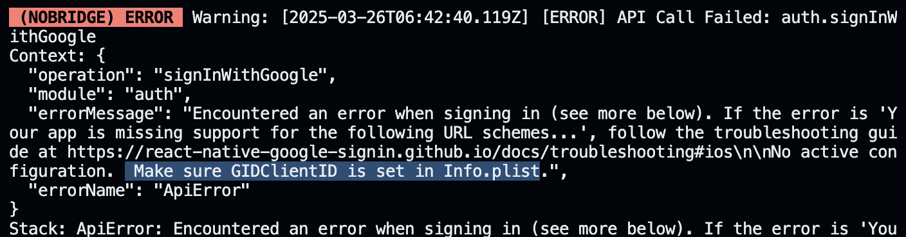

# 구글 인증 오류

##  Make sure GIDClientID is set in Info.plist

[React Native Google Sign In](https://react-native-google-signin.github.io)을 이용해서 구글 로그인을 구현할 때
`await GoogleSignin.hasPlayServices();`을 호출했을 때 발생하는 오류. 



### 해결
`GoogleSignin.configure({...})`을 먼저 실행해야한다.

```tsx
GoogleSignin.configure();

await GoogleSignin.hasPlayServices();
```

- [참고 문서](https://stackoverflow.com/questions/74045260/no-active-configuration-make-sure-gidclientid-is-set-in-info-plist)