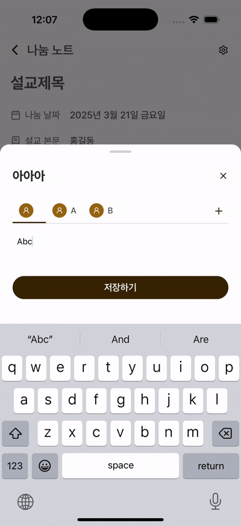

# ScrollView 내부 버튼을 누를때 keyboard가 사라지는 현상

## 문제

scrollview 내부의 탭 버튼을 누를 때, keyboard가 사라지는 현상이 발생함



## 해결

`keyboardShouldPersisTaps`를 `always`로 설정한다

```tsx
<ScrollView horizontal keyboardShouldPersistTaps="always">
// ...
```

> 'always', the keyboard will not dismiss automatically, and the scroll view will not catch taps, but children of the scroll view can catch taps.
