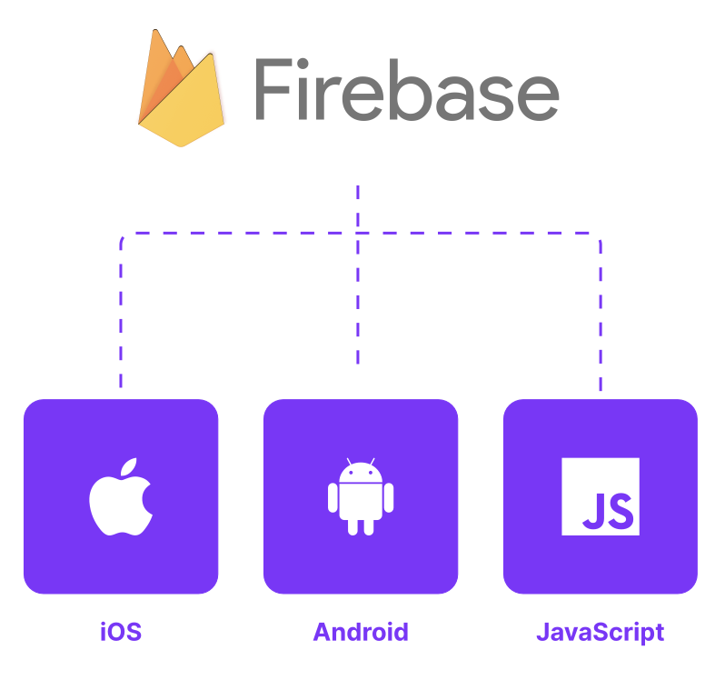
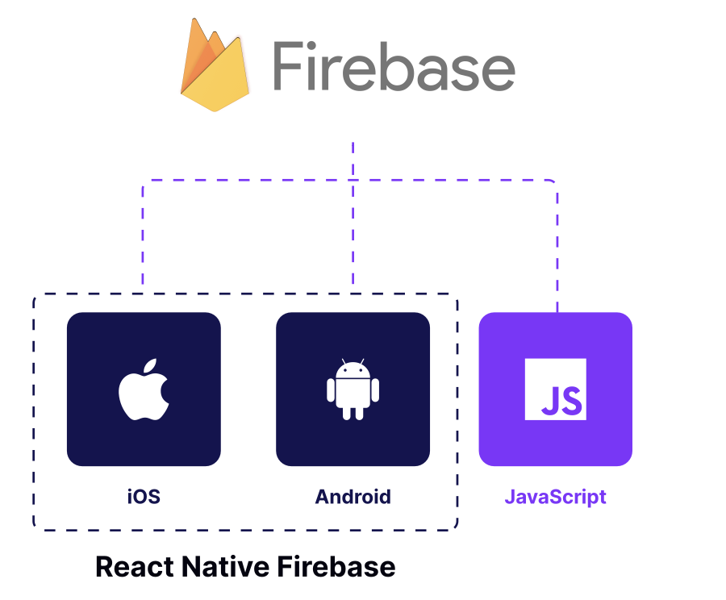

# Always remember to use libraries dedicated to the mobile platform

## a

React Native는 JS로 모바일 앱을 작성하거나, React component를 재사용하거나, 좋아하는 상태 관리 라이브러리를 이용하여 비즈니스 로직을 작성할 수 있는 것이 장점입니다.

하지만 React Native는 웹과 비슷한 기능을 제공하기에, RN과 웹은 같은 환경이 아닌것을 이해하는것이 중요합니다.

예를 들어, web application을 작성한다면 전반적인 CPU 리소스 관리를 신경쓸 필요가 없습니다. 그리고 대부분의 device에서 작동하는 웹사이트는 network와 많은 양의 배터리와 연결되어있습니다.

## 최적화되지 않은 라이브러리는 배터리 소모와 앱을 느리게 만들 수 있습니다.

만약 library가 networking에 강하게 의존하고 있다면(ex. real-time message), 적절한 모바일 library를 사용하는것을 권장합니다.

만약 앱이 백그라운드에서 동작하는데 많은 양의 리소스를 사용한다면, 백그라운드 업데이트 동작의 빈도가 예상보다 줄 수 있습니다.

## 해결책: 적절한 platform-specific version의 라이브러리를 사용하기

예를 들어 Firebase는 웹과 모바일을 위한 SDK를 포함합니다. Realtime Database를 제공하는 기능도 제공하며, React Native에서는 큰 문제없이 web 버전의 Firebase 라이브러리를 사용할 수 있습니다.



```javascript
import { getDatabase, onValue, ref } from "firebase/database";

const database = getDatabase();
onValue(ref(database, "users/123"), (snapshot) => {
	console.log(snapshot.val());
});
```

하지만 이는 mobile과 같은 성능을 제공하지 않기 때문에, 이렇게 작업해서는 안됩니다.

따라서 적절한 native SDK를 제공하고, 다른 native application과 같은 성능과 안정성을 제공하는 Firebase 라이브러리를 사용하는 것이 좋습니다.



```javascript
import database from "@react-native-firebase/database";

database.ref("users/123").on("value", (snapshot) => {
	console.log(snapshot.val());
});
```
