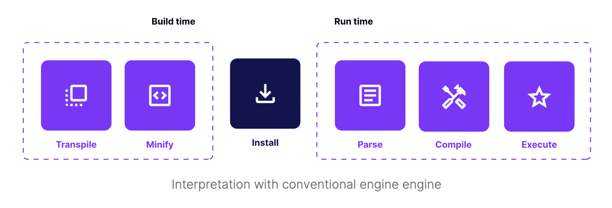

# Think twice before you pick an external library

mobile 개발자는 웹 어플리케이션을 만들 때랑은 다르다.
(ex. web은 asset의 size가 중요하지만, RN은 asset이 filesystem에 위치하기 때문에 똑같이 중요하지 않다.)

- less code means faster opening time
- 코드의 전체 size에 가장 중요한 영향을 미치는 요인은 `library`이다.

## 복잡한 라이브러리는 APP의 속도에 방해된다.

- 앱을 시작할 때, memory에 JS bundle이 load된다.
- JavaScript VM에 의해 parsing 및 execute된다.

이러한 과정을 거치기 때문에, JS bundle은 앱을 시작할 때 로딩 속도에 영향을 미친다(TTI - Time to Interactive)

Metro 번들러는 **Tree Shaking을 지원하지 않기** 때문에 NPM을 통해 받은 모든 코드는 프로젝트의 js bundle에 포함되며 memory에 load, parsing된다.
이는 전체 앱 시작시간에 악영향을 미칠 수 있다.

## bundle size를 분석하는 방법

[react-native-bundle-visualizer](https://github.com/IjzerenHein/react-native-bundle-visualizer)를 이용하여 buldle을 분석할 수 있다.

## 작은 사이즈의 library를 사용하고, 선택적으로 사용하라.

- `moment.js(67.9kb)`보다는 `day.js(2kb)`를 사용한다.
- lodash 라이브러리의 일부 기능만을 사용한다면, 전체 라이브러리를 사용하는 것보다 일부 기능만을 설치한다. (`lodash`대신 `lodash/map`)

:::tip
VSCode를 사용하고있다면, VSCode extension인 [import-cost](https://marketplace.visualstudio.com/items?itemName=wix.vscode-import-cost)를 사용하는 것을 추천
웹사이트인 [Bundlephobia](https://bundlephobia.com/)를 사용하는 방법도 있다.
:::
