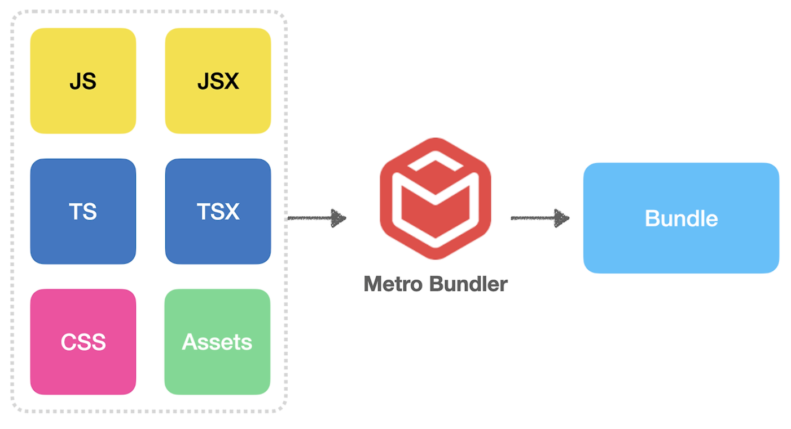
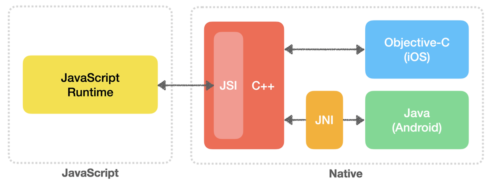
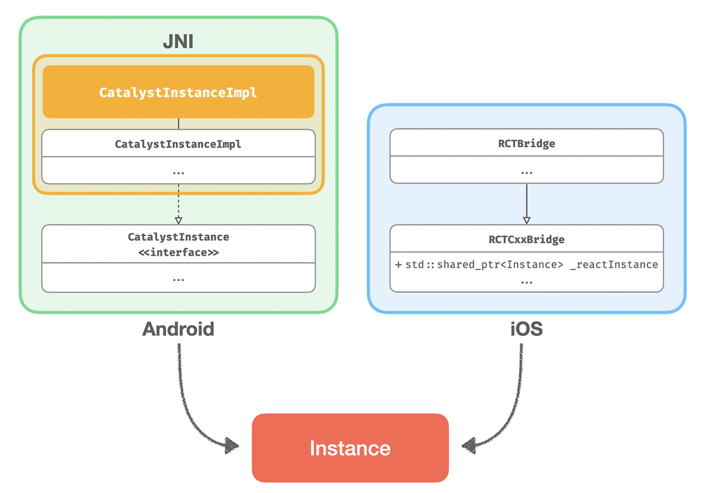

# React Native Under the Hood

> 이근혁님의 [해당 글](https://codevkr.tistory.com/126?category=1063241)을 읽고, 간단 정리

## 번들러 (Bundler)



React Native의 기본 번들러인 Metro는 아래와 같은 과정을 거쳐 번들링을 수행한다.

- 모듈 해석(module Resolve)
  - import 구문 찾기
  - …tree shaking x
- 주입(inject)
  - Polyfill
    - object.es8.js
    - console.js
      - 적용 완료되었다면 console 객체에 \_isPolyfilled 속성을 true로 설정한다.
    - error-guard.js
  - react native 초기화 - InitializeCore.js(RN) ⇒ loadMetroConfig.ts(Metro)
- 변환(transform)
  - babel을 통해 처리, ~~metro-react-native-babel-preset~~ >> @react-native/babel-preset
- 사전 컴파일(pre-compilation ⇒ hermes Engine)  
  
  - Hermes Engine은 빌드타임에 미리 parse, compile까지 진행 ⇒ 즉시 실행가능한 Bytecode 형태로 변환
  - release만 O, debug환경에서는 X
- 개발 서버
  - Metro 서버에서 빌드를 진행 후, localhost:8080을 통해 번들을 전달함

## 런타임



- 네이티브
  - core instance 생성(Android: JNI를 이용), **생성 후 런타임과 관련된 모듈들이 구성된다.**
    
  - JSI(JavaScript Interface)는 자바스크립트 엔진의 인터페이스를 추상화한 API인데, 이를 통해 복잡한 코드 구현 없이 JSI를 통해 자바스크립트 런타임과 상호작용 할 수 있다.
- 자바스크립트 런타임(JS Engine)

  - 자바스크립트 런타임(엔진)은 성능을 위해 대부분 C/C++ 기반으로 구현되어 있다.
    - JSC(JavaScript Core)
    - Hermes
  - 모두 JSExecutorFactory를 통해 런타임 인스턴스가 생성된다
    - proxy runtime → V8(debug only)

  ***

  - makeJSCRuntime() - JSCRuntime.cpp
    ```cpp
    class JSCRuntime : public jsi::Runtime {
    // ...
    std::unique_ptr<jsi::Runtime> makeJSCRuntime() {
      return std::make_unique<JSCRuntime>();
    }
    ```
  - JSCExecutorFactory() - JSCExecutorFactory.mm

    ```
    namespace facebook::react {

    std::unique_ptr<JSExecutor> JSCExecutorFactory::createJSExecutor(
        std::shared_ptr<ExecutorDelegate> delegate,
        std::shared_ptr<MessageQueueThread> __unused jsQueue)
    {
      return std::make_unique<JSIExecutor>(
          facebook::jsc::makeJSCRuntime(), delegate, JSIExecutor::defaultTimeoutInvoker, runtimeInstaller_);
    }

    }
    ```

  - RCTAppSetupDefaultJsExecutorFactory() - RCTAppSetupUtils.mm

    ```cpp
    std::unique_ptr<facebook::react::JSExecutorFactory> RCTAppSetupDefaultJsExecutorFactory(
        RCTBridge *bridge,
        RCTTurboModuleManager *turboModuleManager,
        const std::shared_ptr<facebook::react::RuntimeScheduler> &runtimeScheduler)
    {
      // Necessary to allow NativeModules to lookup TurboModules
      [bridge setRCTTurboModuleRegistry:turboModuleManager];

    #if RCT_DEV
      /**
       * Instantiating DevMenu has the side-effect of registering
       * shortcuts for CMD + d, CMD + i,  and CMD + n via RCTDevMenu.
       * Therefore, when TurboModules are enabled, we must manually create this
       * NativeModule.
       */
      [turboModuleManager moduleForName:"RCTDevMenu"];
    #endif // end RCT_DEV

    #if USE_HERMES
      return std::make_unique<facebook::react::HermesExecutorFactory>(
    #else
      return std::make_unique<facebook::react::JSCExecutorFactory>(
    #endif // USE_HERMES
        facebook::react::RCTJSIExecutorRuntimeInstaller(
          [turboModuleManager, bridge, runtimeScheduler](facebook::jsi::Runtime &runtime) {
            if (!bridge || !turboModuleManager) {
              return;
            }
            if (runtimeScheduler) {
              facebook::react::RuntimeSchedulerBinding::createAndInstallIfNeeded(runtime, runtimeScheduler);
            }
            [turboModuleManager installJSBindings:runtime];
          }));
    }
    ```

  - jsExecutorFactoryForBridge() - RCTRootViewFactory.mm
    ```
    #pragma mark - RCTCxxBridgeDelegate
    - (std::unique_ptr<facebook::react::JSExecutorFactory>)jsExecutorFactoryForBridge:(RCTBridge *)bridge
    {
      _runtimeScheduler = std::make_shared<facebook::react::RuntimeScheduler>(RCTRuntimeExecutorFromBridge(bridge));
      if (RCTIsNewArchEnabled()) {
        std::shared_ptr<facebook::react::CallInvoker> callInvoker =
            std::make_shared<facebook::react::RuntimeSchedulerCallInvoker>(_runtimeScheduler);
        RCTTurboModuleManager *turboModuleManager =
            [[RCTTurboModuleManager alloc] initWithBridge:bridge
                                                 delegate:_turboModuleManagerDelegate
                                                jsInvoker:callInvoker];
        _contextContainer->erase("RuntimeScheduler");
        _contextContainer->insert("RuntimeScheduler", _runtimeScheduler);
        return RCTAppSetupDefaultJsExecutorFactory(bridge, turboModuleManager, _runtimeScheduler);
      } else {
        return RCTAppSetupJsExecutorFactoryForOldArch(bridge, _runtimeScheduler);
      }
    }
    ```
  - start() - RCTCxxBridge.mm
    ```cpp
      // Prepare executor factory (shared_ptr for copy into block)
      std::shared_ptr<JSExecutorFactory> executorFactory;
      if (!self.executorClass) {
        if ([self.delegate conformsToProtocol:@protocol(RCTCxxBridgeDelegate)]) {
          id<RCTCxxBridgeDelegate> cxxDelegate = (id<RCTCxxBridgeDelegate>)self.delegate;
          executorFactory = [cxxDelegate jsExecutorFactoryForBridge:self];
        }
        if (!executorFactory) {
          auto installBindings = RCTJSIExecutorRuntimeInstaller(nullptr);
    #if USE_HERMES
          executorFactory = std::make_shared<HermesExecutorFactory>(installBindings);
    #else
          executorFactory = std::make_shared<JSCExecutorFactory>(installBindings);
    #endif
        }
      } else {
        id<RCTJavaScriptExecutor> objcExecutor = [self moduleForClass:self.executorClass];
        executorFactory.reset(new RCTObjcExecutorFactory(objcExecutor, ^(NSError *error) {
          if (error) {
            [weakSelf handleError:error];
          }
        }));
      }
    ```
    ***
  - JSExecutorFactory() - JSExecutor.h

    ```
    class JSExecutorFactory {
     public:
      virtual std::unique_ptr<JSExecutor> createJSExecutor(
          std::shared_ptr<ExecutorDelegate> delegate,
          std::shared_ptr<MessageQueueThread> jsQueue) = 0;
      virtual ~JSExecutorFactory() {}
    };

    ```

    ```cpp
    class RN_EXPORT JSExecutor {
     public:
      /**
       * Prepares the JS runtime for React Native by installing global variables.
       * Called once before any JS is evaluated.
       */
      virtual void initializeRuntime() = 0;
      /**
       * Execute an application script bundle in the JS context.
       */
      virtual void loadBundle(
          std::unique_ptr<const JSBigString> script,
          std::string sourceURL) = 0;

      /**
       * Add an application "RAM" bundle registry
       */
      virtual void setBundleRegistry(
          std::unique_ptr<RAMBundleRegistry> bundleRegistry) = 0;

      /**
       * Register a file path for an additional "RAM" bundle
       */
      virtual void registerBundle(
          uint32_t bundleId,
          const std::string& bundlePath) = 0;

      /**
       * Executes BatchedBridge.callFunctionReturnFlushedQueue with the module ID,
       * method ID and optional additional arguments in JS. The executor is
       * responsible for using Bridge->callNativeModules to invoke any necessary
       * native modules methods.
       */
      virtual void callFunction(
          const std::string& moduleId,
          const std::string& methodId,
          const folly::dynamic& arguments) = 0;

      /**
       * Executes BatchedBridge.invokeCallbackAndReturnFlushedQueue with the cbID,
       * and optional additional arguments in JS and returns the next queue. The
       * executor is responsible for using Bridge->callNativeModules to invoke any
       * necessary native modules methods.
       */
      virtual void invokeCallback(
          const double callbackId,
          const folly::dynamic& arguments) = 0;

      virtual void setGlobalVariable(
          std::string propName,
          std::unique_ptr<const JSBigString> jsonValue) = 0;

      virtual void* getJavaScriptContext() {
        return nullptr;
      }

      /**
       * Returns whether or not the underlying executor supports debugging via the
       * Chrome remote debugging protocol. If true, the executor should also
       * override the \c createAgentDelegate method.
       */
      virtual bool isInspectable() {
        return false;
      }

      /**
       * The description is displayed in the dev menu, if there is one in
       * this build.  There is a default, but if this method returns a
       * non-empty string, it will be used instead.
       */
      virtual std::string getDescription() = 0;

      virtual void handleMemoryPressure([[maybe_unused]] int pressureLevel) {}

      virtual void destroy() {}
      virtual ~JSExecutor() = default;

      virtual void flush() {}

      static std::string getSyntheticBundlePath(
          uint32_t bundleId,
          const std::string& bundlePath);

      static double performanceNow();

      /**
       * Get a reference to the \c RuntimeTargetDelegate owned (or implemented) by
       * this executor. This reference must remain valid for the duration of the
       * executor's lifetime.
       */
      virtual jsinspector_modern::RuntimeTargetDelegate& getRuntimeTargetDelegate();

     private:
      /**
       * Initialized by \c getRuntimeTargetDelegate if not overridden, and then
       * never changes.
       */
      std::optional<jsinspector_modern::FallbackRuntimeTargetDelegate>
          runtimeTargetDelegate_;
    };
    ```

- 초기 앱 실행 시 런타임(JSC 혹은 Hermes)이 초기화되고 이들과 상호작용 할 수 있는 기반이 마련되며, 상호작용은 프로젝트 구성에 따른 팩토리에서 생성된 `JSExecutor` 를 통해 이루어진다.
