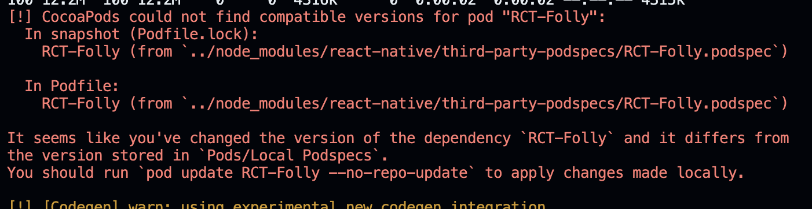

# upgrade to RN 0.74

시대생에서 사용하는 React Native 0.71.19버전은 [더 이상 지원하지 않고](https://reactnative.dev/blog/2024/04/22/release-0.74#upgrade-to-074), 최신 버전으로 권장하고있기 때문에 최신버전인 0.74.1 버전으로 마이그레이션을 진행한다.


## 버전 업그레이드

```bash
$ yarn add react-native@0.74
$ npx react-native upgrade
```

변경되지않은 기존 native 코드들은 기본적으로 react native community에서 제공하는 upgrade-helper를 참고하여 파일을 직접 수정했다.

https://react-native-community.github.io/upgrade-helper/?from=0.71.19&to=0.74.1&package=com.beyondconnect.uoslife&name=uoslife

## trouble shooting



`CocoaPods could not find compatible versions for pod` 에러가 발생한다면, 아래 명령어를 수행하여 해결한다.

```bash
$ pod upgrade && pod install
```

https://github.com/facebook/react-native/issues/42070

### (iOS) Podfile 수정

```ruby
flipper_config = FlipperConfiguration.disabled # 삭제

post_install do |installer|
  ...
  __apply_Xcode_12_5_M1_post_install_workaround(installer) # 삭제
```

0.74버전부터는 flipper x

### (iOS) firebase 에러

https://github.com/reactwg/react-native-releases/issues/284

```ruby
$RNFirebaseAsStaticFramework = false
$RNFirebaseAnalyticsWithoutAdIdSupport = true

use_modular_headers!
```

해당 부분을 지우고, 아래 구문을 추가한다.

```ruby
target 'uoslife' do
  config = use_native_modules!

  use_frameworks! :linkage => :static # 추가
  $RNFirebaseAsStaticFramework = true # 추가

  use_react_native!(
    :path => config[:reactNativePath],
    :app_path => "#{Pod::Config.instance.installation_root}/.."
    )
end
```

https://github.com/facebook/react-native/issues/38282

https://github.com/react-native-webview/react-native-webview/issues/3233

### react-native-bootsplash 업데이트

headless 모드를 기본적으로 지원하기때문에 해당 경고문구가 표시되었다.


[공식문서](https://github.com/zoontek/react-native-bootsplash?tab=readme-ov-file#ios-1)를 따라 `AppDelegate.mm`파일을 수정한 뒤 react-native-bootsplash 패키지를 최신버전으로 업데이트 한 다음, 앱을 재 실행한다.

```bash
$ yarn add react-native-bootsplash@5.5.3 && cd ios && pod install
```

마찬가지로 android도 [공식문서](https://github.com/zoontek/react-native-bootsplash?tab=readme-ov-file#android-1)에 따라 업데이트 해준다.

### (iOS / Android) 여러 라이브러리들에서 발생하는 에러 해결

#### (iOS) react-native-webview 문제


위와같은 문제가 발생하여 아래와 같이 라이브러리를 업데이트해서 해결했다.


#### (iOS / Android) 마찬가지로 발생하는 모든 문제는 라이브러리 업데이트 문제


```bash
$ yarn add react-native-reanimated@3.11.0 && cd android && ./gradlew clean
```

react-native-screens, react-native-safe-area-context 등에서 에러가 발생하는데, 해당 라이브러리들을 모두 최신버전으로 업데이트하면 된다.

추가적으로, `./gradlew clean`을 실행하지 않으면 아래와 같이 codepush에서 duplicate resource 에러가 발생한다.


## 후기

기초 설정 및 iOS 세팅 2시간 + Android 1시간 총 3시간정도 걸렸다.
생각보다 OS별로 업그레이드하고, 빌드해서 확인해보고 할 사항이 많아서 힘들었지만 기본 컴파일 과정같은걸 자세히 알 수 있어서 좋았다.
